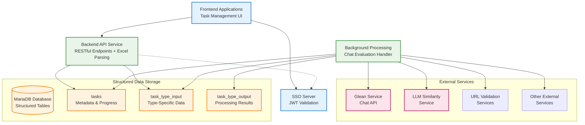
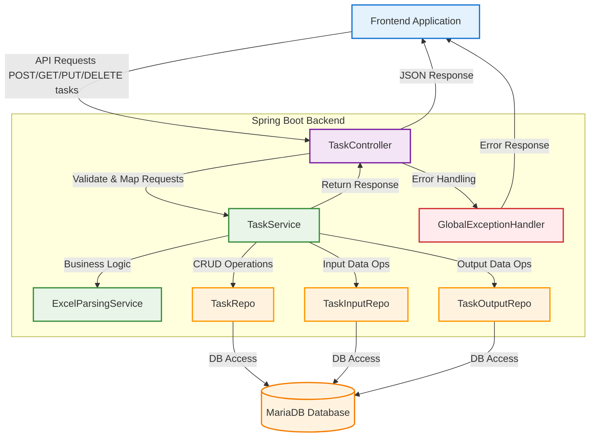
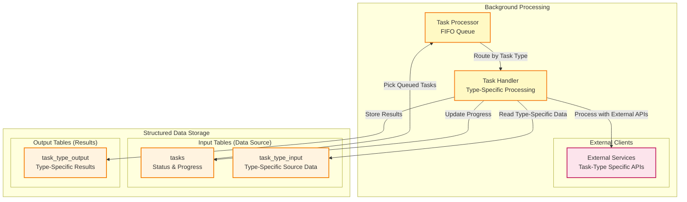

# Internal Task Management API - High-Level Design

## Overview
**Multi-Type Glean-Related Task Management API**

Internal API service for processing data tasks through Excel file uploads. **Version 1.0** supports chat evaluation and URL cleaning, with search evaluation and Q&A preparation planned for future releases. Features immediate parsing, structured storage, and background processing.

## Core Architecture

### High-Level Architecture


### Backend Components Flow


### Background Processing Flow


### Key Design Principles
- **Immediate Parsing**: Excel files parsed during upload, no blob storage
- **Structured Storage**: Task-specific tables for efficient querying
- **Background Processing**: FIFO queue with precise progress tracking
- **Configuration-Driven**: Dynamic task type management via config
- **Type Safety**: Enum-based task types with configuration validation

## API Endpoints

| Method | Endpoint | Purpose |
|--------|----------|---------|
| POST | `/rest/api/v1/tasks` | Upload Excel file, create tasks |
| GET | `/rest/api/v1/tasks` | List tasks (cursor pagination) |
| PUT | `/rest/api/v1/tasks/{id}?cancelled=true` | Cancel task |
| DELETE | `/rest/api/v1/tasks/{id}` | Delete task |
| GET | `/rest/api/v1/tasks/{id}/file` | Download results |
| GET | `/rest/api/v1/task-types` | Get available task types |

## Task Types & Requirements

### Supported Task Types (v1.0)
| Type | Required Columns | Purpose |
|------|------------------|---------|
| **chat-evaluation** | `question`, `golden_answer`, `golden_citations` | Evaluate chat responses |
| **url-cleaning** | `url` | Clean and validate URLs |

### Planned Task Types (Future)
| Type | Required Columns | Purpose |
|------|------------------|---------|
| **search-evaluation** | `query`, `expected_results` | Evaluate search quality |
| **qna-preparation** | `question`, `answer`, `category` | Prepare training datasets |

### File Requirements
- **Format**: .xlsx or .xls files
- **Size**: ~50MB max (configurable per type)
- **Sheets**: 20 max per file
- **Rows**: ~1000 max per sheet (configurable per type)

## Data Flow

### Upload Flow
1. **Upload** → Excel file submitted
2. **Parse** → Immediate column validation & data extraction
3. **Store** → Structured data in task-specific tables
4. **Queue** → Task queued for background processing

### Processing Flow
1. **Poll** → FIFO queue picks tasks by type
2. **Route** → Task routed to type-specific handler
3. **Process** → External service integration & data processing
4. **Track** → Precise row-level progress updates
5. **Complete** → Results stored, Excel file generation

## Configuration Management

### Task Type Configuration (v1.0)
```yaml
app:
  task-types:
    enabled: [chat-evaluation, url-cleaning]
    settings:
      chat-evaluation:
        max-file-size-mb: 50
        max-rows-per-sheet: 1000
        required-columns: [question, golden_answer, golden_citations]
      url-cleaning:
        max-file-size-mb: 25
        max-rows-per-sheet: 5000
        required-columns: [url]
```

### Dynamic Features
- Enable/disable task types at runtime
- Configurable limits per task type
- Validation based on configuration
- API discovery of available types

## Database Design

### Core Tables
- **`tasks`** - Task metadata, status, progress tracking
- **`{type}_input`** - Task-specific input data (e.g., `chat_evaluation_input`)
- **`{type}_output`** - Task-specific results (e.g., `chat_evaluation_output`)

### Key Features
- No blob storage - all data queryable
- Type-specific table structures
- Precise progress tracking with `processed_rows`
- User ownership and access control

## Security & Authentication

- **JWT Authentication** from internal SSO
- **Task Ownership** enforcement
- **Local Token Validation** using SSO public keys
- **User Context** extraction from JWT claims

## Technology Stack

- **Backend**: Spring Boot, Java 21
- **Database**: MariaDB with JPA/Hibernate
- **Processing**: Background tasks with external service integration
- **API**: RESTful with OpenAPI 3.0 specification
- **Configuration**: YAML-based with Spring Boot properties

## Implementation Status

### ✅ Completed (v1.0)
- Multi-type task management system
- Configuration-based task type validation
- Excel parsing and structured storage for chat-evaluation
- Background processing with progress tracking
- Complete REST API with cursor pagination
- Task lifecycle management (CRUD operations)

### 🚧 Next Steps (v1.0)
- Complete URL cleaning task handler implementation
- Excel file generation for downloads (both task types)
- Comprehensive integration testing for both types
- Performance optimization and monitoring

### 🔮 Future Versions
- Search evaluation task type implementation
- Q&A preparation task type implementation
- Additional external service integrations 