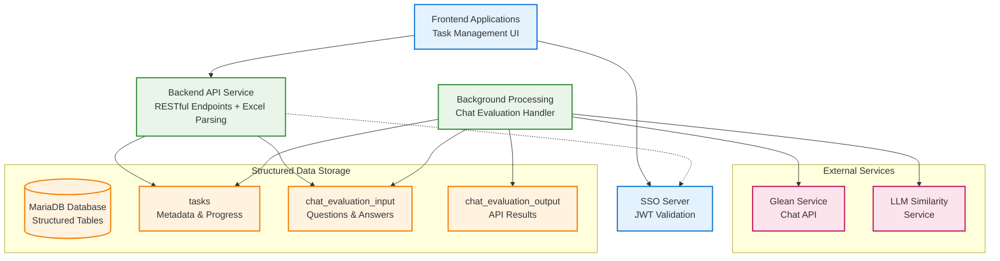
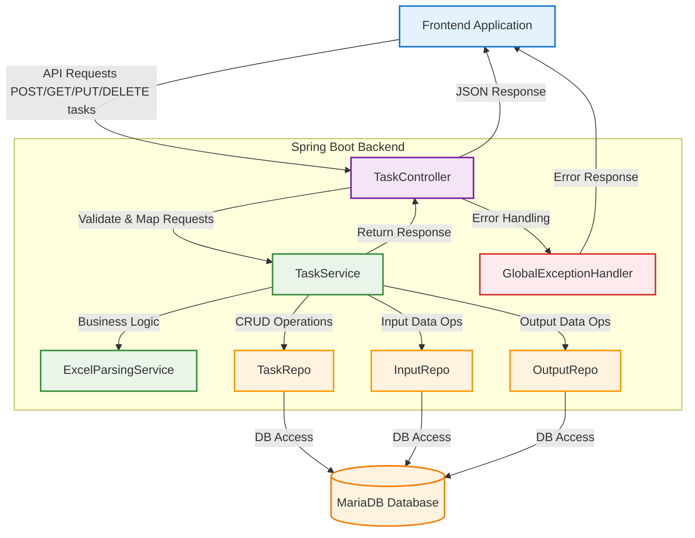
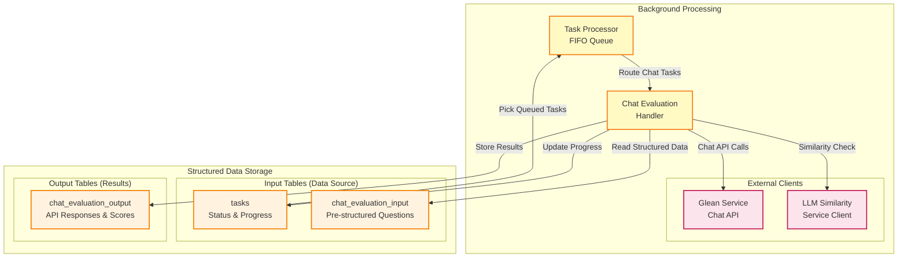

# Internal Task Management API Solution Design

## Project Overview
**Internal Task Management API for [Organization Name]**

This is an internal API service designed for chat evaluation task management within our organization. The service allows users to submit chat evaluation tasks by uploading Excel files, where each sheet becomes a separate task. The API handles all file processing during upload, immediately parsing Excel content into structured data and store into tables for efficient processing and querying.

**Note**: This design documentation focuses exclusively on chat evaluation functionality. Other task types are not discussed in this design.

**Key Characteristics:**
- Internal organizational use only
- JWT-based authentication from frontend applications
- Excel file upload for chat evaluation tasks (questions, golden answers, citations)
- Immediate parsing during upload - no blob storage
- Structured data storage for efficient querying and processing
- Task lifecycle management (create, query, cancel, delete)
- Background processing of structured data with precise progress tracking

**Core Functionality:**
- **File Upload & Parsing**: Users upload Excel files with chat evaluation data (questions, golden answers, citations)
- **Immediate Structuring**: Excel content is parsed during upload and stored in dedicated tables
- **Task Management**: Users can query, cancel, and delete their tasks with structured data responses
- **Background Processing**: Efficient processing of pre-structured data with exact progress tracking
- **Structured API Responses**: Frontend receives structured data instead of encoded blobs
- **Excel File Generation**: Completed tasks provide downloadable Excel files with all evaluation results

**Chat Evaluation Task Requirements:**
- **Excel Structure**: Must contain columns "question", "golden_answer", "golden_citations"
- **Processing**: Each question is sent to external APIs for evaluation and similarity scoring
- **Results**: API answers are compared with golden answers using similarity algorithms

## Documentation Files

### Core Documentation (Active)
- **README.md** - This overview document
- **api-specification.yaml** - OpenAPI specification for chat evaluation endpoints
- **database-schema.md** - Database schema for chat evaluation tables
- **sequence-diagrams-api-handling.md** - API request/response flows
- **sequence-diagram-chat-evaluation.md** - Background processing flows

## System Architecture

### High-Level Architecture


### Service Responsibilities
- **Frontend Applications**: 
  - User interface for task management
  - File upload and task monitoring
  - JWT token handling and SSO integration
  - Display structured task data and results
- **SSO Server**:
  - Single Sign-On authentication
  - JWT token issuance and validation
  - Public key/certificate distribution via JWKS endpoint
- **Backend API Service**: 
  - RESTful API endpoints
  - Local JWT token validation using SSO public keys
  - Excel parsing and chat evaluation task detection during upload
  - Structured data storage in appropriate tables
  - Task lifecycle management (CRUD operations)
  - Response formatting with structured data
- **Background Processing Engine**:
  - FIFO queue management for structured tasks
  - Chat evaluation processing with external service integration
  - Processes pre-structured data from input tables
  - External service integration (Glean Platform, LLM Similarity)
  - Precise progress tracking using processed_rows counters

- **External Services**:
  - Glean Platform Services for chat evaluation
  - LLM Similarity Service for response comparison
- **MariaDB Database**: 
  - Structured data storage in dedicated tables
  - Task metadata and status tracking
  - User ownership and permissions
  - Input data table: chat_evaluation_input
  - Output data table: chat_evaluation_output
  - Task history and audit information
  - No blob storage - all data is immediately queryable

## API Endpoints Design

### Endpoint Overview

| Method | Endpoint | Description | Auth Level |
|--------|----------|-------------|------------|
| POST   | `/rest/v1/tasks` | Upload Excel file with automatic parsing and task creation | User |
| GET    | `/rest/v1/tasks` | List user's tasks with filtering (metadata only) | User |
| GET    | `/rest/v1/tasks/{id}` | Get specific task details with structured input/results data | User |
| PUT    | `/rest/v1/tasks/{id}` | Update/cancel a task | User |
| DELETE | `/rest/v1/tasks/{id}` | Delete a task and associated structured data | User |

**Note**: All endpoints enforce task ownership at the application level - users can only access, modify, or delete their own tasks.

## System Components and Data Flow

### Backend Java Components and Responsibilities


#### Backend Java Components Responsibilities

| Component | Major Responsibilities |
|-----------|------------------------|
| **TaskController** | Handle all HTTP requests for task management (create, query, update, delete), JWT validation, request/response mapping |
| **TaskService** | Core business logic for all task operations, transaction management, coordination between repositories and Excel parsing |
| **ExcelParsingService** | Excel file parsing, sheet detection, data validation (used during task creation) |
| **TaskRepo** | CRUD operations for task metadata |
| **InputRepo** | CRUD operations for input data (questions, answers, citations) |
| **OutputRepo** | CRUD operations for output/results data |
| **GlobalExceptionHandler** | Centralized error handling for all API endpoints |

### Background Processing Flow Chart (Structured Data)


#### Background Processing Component Responsibilities

| Component | Primary Responsibility | Key Operations |
|-----------|----------------------|----------------|
| **Task Processor (TaskProcessor)** | Task queue management and job scheduling | FIFO queue polling, task status monitoring, job routing to appropriate handlers |
| **Chat Evaluation Handler (ChatEvalHandler)** | Core business logic for chat evaluation processing | Question processing, API orchestration, similarity calculation, progress tracking |
| **Glean Service (GleanServices)** | External chat API integration | Chat request processing, response handling, error management, timeout handling |
| **LLM Similarity Service (LLMService)** | Answer similarity computation | Text comparison, similarity scoring, result validation |
| **tasks Table (TasksTable)** | Task status and progress persistence | Status updates, progress percentage calculation, error logging, completion tracking |
| **chat_evaluation_input Table (ChatInputTable)** | Source data retrieval for processing | Row-by-row data reading, question extraction, golden answer retrieval |
| **chat_evaluation_output Table (ChatOutputTable)** | Processing results storage | API response storage, similarity scores, processing metrics, result metadata |


### Data Flow Patterns

#### User-Facing Operations:
1. **Upload Flow**: UI → Backend API → Excel Parser → Data Structurer → Store in Input Tables → Create Task Records
2. **Query Flow**: UI → Backend API → Query Handler → Join Input/Output Tables → Return Structured Data
3. **Management Flow**: UI → Backend API → Task Manager → Update Task Status → Return Structured Response

#### Background Operations:
4. **Processing Flow**: Task Processor → Read from Input Tables → Process with External APIs → Store in Output Tables → Update Progress
5. **Status Update Flow**: Task Handlers → Update processed_rows in Tasks Table → Real-time Progress

#### Key Features:
- **Immediate Feedback**: Parsing errors detected during upload, not background processing
- **Structured Responses**: Frontend receives structured data, no client-side parsing needed
- **Precise Progress**: Exact row-level progress tracking (processed_rows/row_count)
- **Better Performance**: No blob parsing overhead in background processing
- **Enhanced Querying**: Direct SQL queries on structured data instead of blob decoding
- **Excel File Generation**: Complete evaluation results available as downloadable Excel files for completed tasks

## Authentication & Authorization

### JWT Token Flow
- Frontend applications obtain JWT tokens from our internal SSO server
- Each API request includes JWT token in Authorization header: `Bearer <token>`
- **Key Distribution**: Backend API Service obtains public keys from SSO server at startup and periodically refreshes them
- **Token Validation**: API validates JWT signature locally using SSO public keys (no SSO server call per request)
- **User Context**: API extracts user context (user_id, roles, permissions) from validated JWT claims
- User context is used for task ownership and access control

## Database Design

### Database Tables Overview

The system uses the following database tables with structured data storage:

| Table Name | Purpose | Type |
|------------|---------|------|
| **tasks** | Task metadata, progress tracking, and status | Core |
| **chat_evaluation_input** | Structured questions, answers, and citations | Primary Data Storage |
| **chat_evaluation_output** | API responses and similarity scores | Results |

**Key Features:**
- **No Blob Storage**: All data stored in queryable structured format
- **Primary Data Storage**: Input tables store parsed Excel data directly during upload
- **Enhanced Metadata**: Added processing times and detailed error information

For detailed table schemas, constraints, indexes, and relationships, see the **database-schema.md** documentation.

### Task Status Flow
- **queueing**: Task created with parsed data, waiting for background processing
- **processing**: Background processing is executing on the parsed rows
- **completed**: All rows processed successfully
- **cancelled**: Task cancelled by user
- **failed**: Background processing failed with error

## Sequence Diagrams

The complete system architecture and data flow patterns are documented in the **System Components and Data Flow** section above, which includes:

- **Task Submission, Parsing & Structured Storage Flow Chart** - Shows immediate Excel parsing and structured data storage during upload
- **Background Processing Flow Chart** - Shows background processing of pre-structured data from input tables
- **Component Responsibilities Summary** - Details the role and relationships of each system component
- **Data Flow Patterns** - Documents the data flow patterns for both user-facing and background operations

For detailed API endpoint sequence diagrams and request/response flows, refer to the separate **sequence-diagrams-api-handling.md** documentation.

## Error Handling Strategy

### Standard Error Response Format
```json
{
  "error": {
    "code": "ERROR_CODE",
    "message": "Human readable message",
    "details": "Additional context",
    "timestamp": "2024-01-01T00:00:00Z",
    "trace_id": "request_uuid",
    "user_id": "extracted_from_jwt"
  }
}
```

### Error Scenarios
- **Invalid Excel File**: Return 400 with file format validation errors
- **Missing Required Columns**: Return 400 when Excel doesn't contain question, golden_answer, golden_citations columns
- **File Size Limit Exceeded**: Return 413 with size limit information
- **Task Not Found**: Return 404 for non-existent or unauthorized tasks
- **Excel Parsing Failure**: Return 400 with specific parsing error details (immediate feedback)
- **Database Connection Issues**: Return 500 with appropriate error message

## Performance Considerations

### Upload Processing Optimization
- **Immediate Parsing**: Parse Excel during upload for immediate user feedback
- **Streaming Upload**: Process large Excel files without loading entirely in memory
- **Chat Evaluation Detection**: Efficient column header analysis for task validation
- **Bulk Insert**: Optimized batch inserts for structured data storage
- **Transaction Management**: Single transaction per sheet for data consistency

### Query Performance
- **Structured Queries**: Direct SQL queries on structured data (no blob parsing)
- **Optimized Joins**: Efficient joins between input and output tables for complete data views
- **Selective Loading**: Query specific columns without loading full records
- **Progress Tracking**: Real-time progress updates using processed_rows counters

### Background Processing
- **No Parsing Overhead**: Data is already structured and ready for processing
- **Immediate Processing**: Background jobs start immediately with structured data
- **Resume Capability**: Precise resume points using processed_rows counters
- **Memory Efficiency**: Process one row at a time from structured tables

### Scalability Plans
- Horizontal scaling with stateless API instances
- Database connection pooling and read replicas
- Structured data optimization with proper indexing and compression
- Background job queues for task processing
- OpenTelemetry metrics for performance monitoring and auto-scaling triggers

## Security Considerations

### Authentication & Authorization
- **SSO Integration**: Centralized authentication through Single Sign-On server
- **JWT Token Validation**: Cryptographic validation using public keys from SSO server
- **User Context Extraction**: Secure extraction of user identity and permissions
- **Access Control**: Task ownership validation for all operations
- **OpenTelemetry Audit Logging**: Complete request audit trail with correlation IDs for security compliance

### Data Security
- **Structured Data Validation**: Strict validation of parsed Excel content
- **Size Limits**: Maximum file size, sheet count, and row count restrictions
- **User Isolation**: Users can only access their own tasks and structured data
- **Access Control**: Task ownership validation for all operations
- **Audit Logging**: Complete request audit trail for security compliance

### Data Protection
- **PII Handling**: Secure processing of structured data from Excel files
- **Access Control**: Task ownership validation for all operations
- **Audit Logging**: Complete request audit trail for security compliance
- **Network Security**: Internal service communication over encrypted channels
- **Data Retention**: Configurable data retention policies with secure deletion of structured data
- **Compliance**: GDPR, SOX, and industry-standard compliance measures

## Next Steps
1. [ ] Implement Excel parsing and chat evaluation task detection during upload
2. [ ] Create structured data storage logic for chat evaluation tasks
3. [ ] Update background processing to read from structured input tables
4. [ ] Modify API responses to return structured data instead of blobs
5. [ ] Implement precise progress tracking with processed_rows counters
6. [ ] Design user interface for structured data display and management
8. [ ] Performance testing with structured data approach 