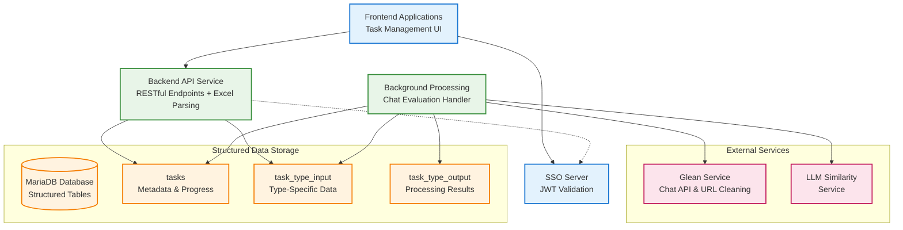
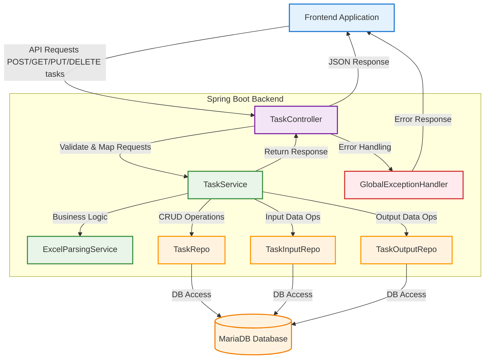
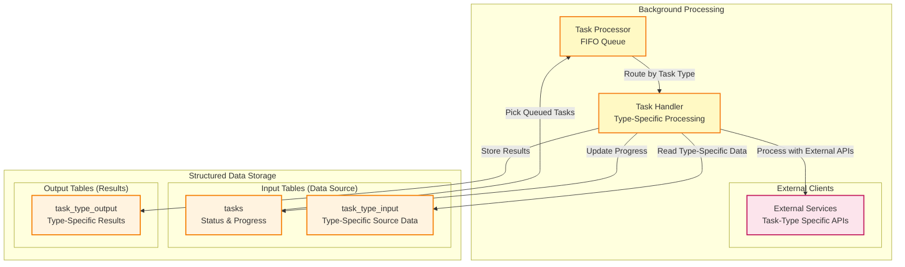

# Internal Task Management API Solution Design

## Project Overview
**Internal Task Management API for [Organization Name]**

This is an internal API service designed for multi-type glean-related task management within our organization. The service allows users to submit various types of data processing tasks by uploading Excel files, where each sheet becomes a separate task. The API handles all file processing during upload, immediately parsing Excel content into structured data and storing it in tables for efficient processing and querying.

**Supported Task Types (v1.0):**
- **Chat Evaluation**: Evaluate chat responses against golden answers using LLM similarity
- **URL Cleaning**: Clean and validate URLs using Glean service  

**Future Task Types (planned):**
- **Search Evaluation**: Evaluate search results quality and relevance
- **Q&A Preparation**: Prepare questions and answers for training datasets

**Key Characteristics:**
- Internal organizational use only
- JWT-based authentication from frontend applications
- Excel file upload for various task types with configurable column requirements
- Immediate parsing during upload - no blob storage
- Structured data storage for efficient querying and processing
- Task lifecycle management (create, query, cancel, delete)
- Background processing of structured data with precise progress tracking
- Configuration-based task type management with dynamic validation

**Core Functionality:**
- **File Upload & Parsing**: Users upload Excel files with task-specific data based on configurable column requirements
- **Immediate Structuring**: Excel content is parsed during upload and stored in dedicated tables per task type
- **Task Management**: Users can query, cancel, and delete their tasks with structured data responses
- **Background Processing**: Efficient processing of pre-structured data with exact progress tracking and external service integration
- **Structured API Responses**: Frontend receives structured data instead of encoded blobs
- **Excel File Generation**: Completed tasks provide downloadable Excel files with all processing results
- **Configuration-Based Task Types**: Dynamic task type management through application configuration
- **Cursor-Based Pagination**: Efficient pagination for large task lists using cursor-based approach


**General File Requirements:**
- **File Format**: .xlsx or .xls files only
- **File Size**: Maximum size varies by task type (configurable, typically 50MB)
- **Sheet Limits**: Maximum 20 sheets per file
- **Row Limits**: Maximum rows per sheet varies by task type (configurable, typically 1000 rows)

**Task-Specific Column Requirements (v1.0):**
- **Chat Evaluation**: `question`, `golden_answer`, `golden_citations`
- **URL Cleaning**: `url`

**Future Column Requirements (planned):**
- **Search Evaluation**: `query`, `expected_results`  
- **Q&A Preparation**: `question`, `answer`, `category`

**Processing & Output:**
- **Background Processing**: Each task type integrates with relevant external services
- **Progress Tracking**: Real-time progress updates with row-level precision
- **Results**: Downloadable Excel files with task-specific result sheets and analysis

## Documentation Files

### Core Documentation (Active)
- **README.md** - This overview document with system architecture and implementation status
- **api-specification.yaml** - Complete OpenAPI 3.0.3 specification with all endpoints, schemas, and error responses
- **database-schema.md** - Database schema for all task types and structured data storage
- **sequence-diagrams-api-handling.md** - API request/response flows for task management
- **sequence-diagram-chat-evaluation.md** - Background processing flows (example with chat evaluation)

### API Specification Compliance
This implementation fully complies with the OpenAPI specification defined in `api-specification.yaml`:

**✅ All Endpoints Implemented:**
- `POST /rest/api/v1/tasks` - File upload with multipart/form-data
- `GET /rest/api/v1/tasks` - Cursor-based pagination with query parameters
- `PUT /rest/api/v1/tasks/{id}?cancelled=true` - Task cancellation
- `DELETE /rest/api/v1/tasks/{id}` - Task deletion
- `GET /rest/api/v1/tasks/{id}/file` - Excel file download
- `GET /rest/api/v1/task-types` - Task type discovery

**✅ Standard Error Response Format:**
```json
{
  "error": {
    "code": "ERROR_CODE",
    "message": "Human readable message", 
    "details": "Additional context",
    "timestamp": "2024-01-01T00:00:00Z",
    "request_id": "uuid",
    "user_id": "extracted_from_jwt"
  }
}
```

**✅ Complete Schema Compliance:**
- Task status enum: `queueing`, `processing`, `completed`, `cancelled`, `failed`
- Task type enum: v1.0 supports `chat-evaluation`, `url-cleaning` (planned: `search-evaluation`, `qna-preparation`)
- Pagination metadata with cursor support
- File upload validation and error responses for all task types

## System Architecture

### High-Level Architecture


### Service Responsibilities
- **Frontend Applications**: 
  - User interface for task management
  - File upload and task monitoring
  - JWT token handling and SSO integration
  - Display structured task data and results
- **SSO Server**:
  - Single Sign-On authentication
  - JWT token issuance and validation
  - Public key/certificate distribution via JWKS endpoint
- **Backend API Service**: 
  - RESTful API endpoints
  - Local JWT token validation using SSO public keys
  - Excel parsing and task type detection during upload (based on configuration)
  - Structured data storage in task-type-specific tables
  - Task lifecycle management (CRUD operations)
  - Response formatting with structured data
- **Background Processing Engine**:
  - FIFO queue management for structured tasks
  - Multi-type task processing with configurable external service integration
  - Processes pre-structured data from task-type-specific input tables
  - External service integration (Glean Platform for multiple task types, LLM Similarity, etc.)
  - Precise progress tracking using processed_rows counters

- **External Services**:
  - Glean Platform Services for chat evaluation and URL cleaning tasks
  - LLM Similarity Service for response comparison
  - Other task-type-specific external services
- **MariaDB Database**: 
  - Structured data storage in dedicated tables per task type
  - Task metadata and status tracking
  - User ownership and permissions
  - Task-type-specific input tables (e.g., chat_evaluation_input, url_cleaning_input)
  - Task-type-specific output tables (e.g., chat_evaluation_output, url_cleaning_output)
  - Task history and audit information
  - No blob storage - all data is immediately queryable

## API Endpoints Design

### Endpoint Overview

| Method | Endpoint | Description | Auth Level |
|--------|----------|-------------|------------|
| POST   | `/rest/api/v1/tasks` | Upload Excel file with automatic parsing and task creation | User |
| GET    | `/rest/api/v1/tasks` | List user's tasks with cursor-based pagination (metadata only) | User |
| PUT    | `/rest/api/v1/tasks/{id}?cancelled=true` | Cancel a task (only queueing/processing status) | User |
| DELETE | `/rest/api/v1/tasks/{id}` | Delete a task and associated structured data | User |
| GET    | `/rest/api/v1/tasks/{id}/file` | Download task evaluation results as Excel file | User |
| GET    | `/rest/api/v1/task-types` | Get available task types with configuration | User |

**Note**: All endpoints enforce task ownership at the application level - users can only access, modify, or delete their own tasks.

## System Components and Data Flow

### Backend Java Components and Responsibilities


#### Backend Java Components Responsibilities

| Component | Major Responsibilities |
|-----------|------------------------|
| **TaskController** | Handle all HTTP requests for task management (create, query, update, delete), JWT validation, request/response mapping |
| **TaskService** | Core business logic for all task operations, transaction management, coordination between repositories and Excel parsing |
| **ExcelParsingService** | Excel file parsing, sheet detection, task type-specific data validation (configured per task type) |
| **TaskRepo** | CRUD operations for task metadata |
| **InputRepo** | CRUD operations for task-type-specific input data (questions, URLs, etc.) |
| **OutputRepo** | CRUD operations for task-type-specific output/results data |
| **GlobalExceptionHandler** | Centralized error handling for all API endpoints |

### Background Processing Flow Chart (Structured Data)


#### Background Processing Component Responsibilities

| Component | Primary Responsibility | Key Operations |
|-----------|----------------------|----------------|
| **Task Processor (TaskProcessor)** | Task queue management and job scheduling | FIFO queue polling, task status monitoring, job routing to task handlers |
| **Task Handler (TaskHandler)** | Core business logic for task-type-specific processing | Data processing, external API orchestration, result calculation, progress tracking |
| **External Services** | Task-type-specific external service integration | API request processing, response handling, error management, timeout handling |
| **tasks Table (TasksTable)** | Task status and progress persistence | Status updates, progress percentage calculation, error logging, completion tracking |
| **Input Tables (task_type_input)** | Task-type-specific source data retrieval | Row-by-row data reading, task-specific field extraction, validation |
| **Output Tables (task_type_output)** | Task-type-specific results storage | Processing results storage, metrics, analysis data, result metadata |


### Data Flow Patterns

#### User-Facing Operations:
1. **Upload Flow**: UI → Backend API → Excel Parser → Data Structurer → Store in Input Tables → Create Task Records
2. **Query Flow**: UI → Backend API → Query Handler → Join Input/Output Tables → Return Structured Data (with cursor-based pagination)
3. **Management Flow**: UI → Backend API → Task Manager → Update Task Status → Return Structured Response
4. **Download Flow**: UI → Backend API → Excel Generator → Return Complete Results as Excel File
5. **Task Type Discovery**: UI → Backend API → Configuration Service → Return Available Task Types

#### Background Operations:
6. **Processing Flow**: Task Processor → Read from Input Tables → Process with External APIs → Store in Output Tables → Update Progress
7. **Status Update Flow**: Task Handlers → Update processed_rows in Tasks Table → Real-time Progress

#### Key Features:
- **Immediate Feedback**: Parsing errors detected during upload, not background processing
- **Structured Responses**: Frontend receives structured data, no client-side parsing needed
- **Precise Progress**: Exact row-level progress tracking (processed_rows/row_count)
- **Better Performance**: No blob parsing overhead in background processing
- **Enhanced Querying**: Direct SQL queries on structured data instead of blob decoding
- **Excel File Generation**: Complete evaluation results available as downloadable Excel files for completed tasks
- **Configuration-Based Validation**: Dynamic task type validation using application configuration
- **Cursor-Based Pagination**: Efficient pagination for large task lists using task IDs as cursors

## Authentication & Authorization

### JWT Token Flow
- Frontend applications obtain JWT tokens from our internal SSO server
- Each API request includes JWT token in Authorization header: `Bearer <token>`
- **Key Distribution**: Backend API Service obtains public keys from SSO server at startup and periodically refreshes them
- **Token Validation**: API validates JWT signature locally using SSO public keys (no SSO server call per request)
- **User Context**: API extracts user context (user_id, roles, permissions) from validated JWT claims
- User context is used for task ownership and access control

## Database Design

### Database Tables Overview

The system uses the following database tables with structured data storage:

| Table Name | Purpose | Type |
|------------|---------|------|
| **tasks** | Task metadata, progress tracking, and status | Core |
| **chat_evaluation_input** | Structured questions, answers, and citations | Primary Data Storage |
| **chat_evaluation_output** | API responses and similarity scores | Results |

**Key Features:**
- **No Blob Storage**: All data stored in queryable structured format
- **Primary Data Storage**: Input tables store parsed Excel data directly during upload
- **Enhanced Metadata**: Added processing times and detailed error information

For detailed table schemas, constraints, indexes, and relationships, see the **database-schema.md** documentation.

### Task Status Flow
- **queueing**: Task created with parsed data, waiting for background processing
- **processing**: Background processing is executing on the parsed rows
- **completed**: All rows processed successfully
- **cancelled**: Task cancelled by user
- **failed**: Background processing failed with error

### Task Type Management
The system supports configuration-based task type management:

**Currently Supported Task Types (v1.0):**
- **chat-evaluation**: Chat evaluation with questions, golden answers, and citations
- **url-cleaning**: URL cleaning tasks using Glean service

**Planned Task Types (future versions):**
- **search-evaluation**: Search result evaluation (configurable)
- **qna-preparation**: Q&A dataset preparation (configurable)

**Configuration Features:**
- Enable/disable task types via application configuration
- Per-task-type settings (file size limits, required columns, processing parameters)
- Dynamic validation and metadata retrieval
- API endpoint to discover available task types

**Task Type Configuration Example (v1.0):**
```yaml
app:
  task-types:
    enabled:
      - chat-evaluation
      - url-cleaning
    settings:
      chat-evaluation:
        display-name: "Chat Evaluation"
        max-file-size-mb: 50
        required-columns: [question, golden_answer, golden_citations]
      url-cleaning:
        display-name: "URL Cleaning"
        max-file-size-mb: 25
        required-columns: [url]
```

## Sequence Diagrams

The complete system architecture and data flow patterns are documented in the **System Components and Data Flow** section above, which includes:

- **Task Submission, Parsing & Structured Storage Flow Chart** - Shows immediate Excel parsing and structured data storage during upload
- **Background Processing Flow Chart** - Shows background processing of pre-structured data from input tables
- **Component Responsibilities Summary** - Details the role and relationships of each system component
- **Data Flow Patterns** - Documents the data flow patterns for both user-facing and background operations

For detailed API endpoint sequence diagrams and request/response flows, refer to the separate **sequence-diagrams-api-handling.md** documentation.

## Error Handling Strategy

### Standard Error Response Format
```json
{
  "error": {
    "code": "ERROR_CODE",
    "message": "Human readable message",
    "details": "Additional context",
    "timestamp": "2024-01-01T00:00:00Z",
    "trace_id": "request_uuid",
    "user_id": "extracted_from_jwt"
  }
}
```

### Error Scenarios

**File Upload Errors (400 Bad Request):**
- **Invalid Excel File**: File format validation errors (must be .xlsx or .xls)
- **Missing Required Columns**: Excel doesn't contain required columns for specified task type
- **File Too Large**: File exceeds maximum size limit (varies by task type, configurable)
- **Too Many Rows**: Sheet exceeds maximum row limit (varies by task type, configurable)
- **Too Many Sheets**: File exceeds maximum sheet limit (typically 20 sheets per file)
- **Invalid Task Type**: Unknown or disabled task type in configuration
- **Excel Parsing Failure**: Task-type-specific parsing error details (immediate feedback)

**Task Management Errors:**
- **Task Not Found (404)**: Non-existent or unauthorized tasks
- **Forbidden (403)**: Insufficient permissions or task ownership violation
- **Invalid Status (400)**: Cannot cancel completed/failed tasks, cannot delete processing tasks
- **Task Not Completed (400)**: Cannot download results for incomplete tasks

**Authentication Errors:**
- **Unauthorized (401)**: Invalid or expired JWT token
- **Rate Limit Exceeded (429)**: Too many requests (1 task per minute per user)

**System Errors:**
- **Internal Server Error (500)**: Database connection issues, unexpected server errors

## Performance Considerations

### Upload Processing Optimization
- **Immediate Parsing**: Parse Excel during upload for immediate user feedback
- **Streaming Upload**: Process large Excel files without loading entirely in memory
- **Chat Evaluation Detection**: Efficient column header analysis for task validation
- **Bulk Insert**: Optimized batch inserts for structured data storage
- **Transaction Management**: Single transaction per sheet for data consistency

### Query Performance
- **Structured Queries**: Direct SQL queries on structured data (no blob parsing)
- **Optimized Joins**: Efficient joins between input and output tables for complete data views
- **Selective Loading**: Query specific columns without loading full records
- **Progress Tracking**: Real-time progress updates using processed_rows counters
- **Cursor-Based Pagination**: Efficient pagination using task IDs as cursors for large datasets
- **Configuration-Based Validation**: Fast task type validation using in-memory configuration cache

### Background Processing
- **No Parsing Overhead**: Data is already structured and ready for processing
- **Immediate Processing**: Background jobs start immediately with structured data
- **Resume Capability**: Precise resume points using processed_rows counters
- **Memory Efficiency**: Process one row at a time from structured tables

### Scalability Plans
- Horizontal scaling with stateless API instances
- Database connection pooling and read replicas
- Structured data optimization with proper indexing and compression
- Background job queues for task processing
- OpenTelemetry metrics for performance monitoring and auto-scaling triggers

## Security Considerations

### Authentication & Authorization
- **SSO Integration**: Centralized authentication through Single Sign-On server
- **JWT Token Validation**: Cryptographic validation using public keys from SSO server
- **User Context Extraction**: Secure extraction of user identity and permissions
- **Access Control**: Task ownership validation for all operations
- **OpenTelemetry Audit Logging**: Complete request audit trail with correlation IDs for security compliance

### Data Security
- **Structured Data Validation**: Strict validation of parsed Excel content
- **Size Limits**: Maximum file size, sheet count, and row count restrictions
- **User Isolation**: Users can only access their own tasks and structured data
- **Access Control**: Task ownership validation for all operations
- **Audit Logging**: Complete request audit trail for security compliance

### Data Protection
- **PII Handling**: Secure processing of structured data from Excel files
- **Access Control**: Task ownership validation for all operations
- **Audit Logging**: Complete request audit trail for security compliance
- **Network Security**: Internal service communication over encrypted channels
- **Data Retention**: Configurable data retention policies with secure deletion of structured data
- **Compliance**: GDPR, SOX, and industry-standard compliance measures


### Reference Documentation

For further reference, please consider the following sections:

* [Official Apache Maven documentation](https://maven.apache.org/guides/index.html)
* [Spring Boot Maven Plugin Reference Guide](https://docs.spring.io/spring-boot/3.5.0/maven-plugin)
* [Create an OCI image](https://docs.spring.io/spring-boot/3.5.0/maven-plugin/build-image.html)
* [Spring Data JPA](https://docs.spring.io/spring-boot/3.5.0/reference/data/sql.html#data.sql.jpa-and-spring-data)
* [Spring Reactive Web](https://docs.spring.io/spring-boot/3.5.0/reference/web/reactive.html)

### Guides

The following guides illustrate how to use some features concretely:

* [Accessing Data with JPA](https://spring.io/guides/gs/accessing-data-jpa/)
* [Building a Reactive RESTful Web Service](https://spring.io/guides/gs/reactive-rest-service/)

### Maven Parent overrides

Due to Maven's design, elements are inherited from the parent POM to the project POM.
While most of the inheritance is fine, it also inherits unwanted elements like `<license>` and `<developers>` from the
parent.
To prevent this, the project POM contains empty overrides for these elements.
If you manually switch to a different parent and actually want the inheritance, you need to remove those overrides.


## Implementation Status

### ✅ Completed Features
1. **Excel parsing and multi-type task detection during upload** - ✅ Implemented
2. **Structured data storage logic for multiple task types** - ✅ Implemented  
3. **Background processing reading from task-type-specific input tables** - ✅ Implemented
4. **API responses returning structured data instead of blobs** - ✅ Implemented
5. **Precise progress tracking with processed_rows counters** - ✅ Implemented
6. **Configuration-based task type management** - ✅ Implemented
7. **Cursor-based pagination for task lists** - ✅ Implemented
8. **Task cancellation and deletion endpoints** - ✅ Implemented
9. **Excel file download for completed tasks** - ✅ Implemented
10. **Task type discovery endpoint** - ✅ Implemented

### 🚧 Next Steps (v1.0)
1. [ ] Complete URL cleaning task handler implementation
2. [ ] Implement Excel file generation for download endpoint (both task types)
3. [ ] Add comprehensive integration tests for chat-evaluation and url-cleaning
4. [ ] Design user interface for both supported task types
5. [ ] Performance testing with both task types
6. [ ] Add OpenTelemetry metrics and tracing
7. [ ] Implement rate limiting (1 task per minute per user)
8. [ ] Add database migration scripts for production deployment
9. [ ] Security audit and penetration testing

### 🔮 Future Versions
1. [ ] Implement search evaluation task type handler
2. [ ] Implement Q&A preparation task type handler
3. [ ] Add support for additional external service integrations
4. [ ] Expand configuration options for new task types 