# Frontend-Backend Architecture Patterns Guide

## Table of Contents
1. [Architecture Patterns Overview](#architecture-patterns-overview)
2. [Detailed Architecture Diagrams](#detailed-architecture-diagrams)
3. [Comparison Tables](#comparison-tables)
4. [Technical Abbreviations & Terms](#technical-abbreviations--terms)
5. [Recommendations](#recommendations)

---

## Architecture Patterns Overview

| **Pattern** | **Complexity** | **Security Rating** | **Best Use Cases** | **Tech Examples** |
|-------------|----------------|-------------------|-------------------|------------------|
| **Traditional SSR** | ⭐⭐ | 🛡️🛡️🛡️🛡️ | Content-heavy sites, blogs, e-commerce | Rails, Django, PHP, JSP |
| **SPA + Direct API** | ⭐⭐⭐ | 🛡️🛡️🛡️ | Dashboards, admin panels, internal tools | React+REST, Vue+GraphQL |
| **BFF/Reverse Proxy** | ⭐⭐⭐ | 🛡️🛡️🛡️🛡️ | Enterprise apps, microservices | Nginx+SPA, Node.js Express |
| **API Gateway** | ⭐⭐⭐⭐ | 🛡️🛡️🛡️🛡️🛡️ | Microservices, large scale | Kong, AWS API Gateway, Zuul |
| **Micro-frontends** | ⭐⭐⭐⭐⭐ | 🛡️🛡️🛡️ | Large organizations, multiple teams | Module Federation, Single-SPA |
| **JAMstack** | ⭐⭐ | 🛡️🛡️🛡️ | Blogs, marketing sites, documentation | Gatsby+Netlify, Next.js+Vercel |
| **SSR with Hydration** | ⭐⭐⭐⭐ | 🛡️🛡️🛡️🛡️ | E-commerce, content+app hybrids | Next.js, Nuxt.js, SvelteKit |
| **Edge Computing** | ⭐⭐⭐⭐ | 🛡️🛡️🛡️🛡️ | Global apps, real-time features | Cloudflare Workers, AWS Lambda@Edge |
| **GraphQL Federation** | ⭐⭐⭐⭐ | 🛡️🛡️🛡️ | Data-heavy apps, mobile APIs | Apollo Federation, GraphQL Mesh |
| **Event-Driven** | ⭐⭐⭐⭐ | 🛡️🛡️🛡️ | Chat apps, live dashboards, gaming | Socket.io, WebSockets, SSE |

---

## Detailed Architecture Diagrams

### 1. Traditional Server-Side Rendering (SSR)

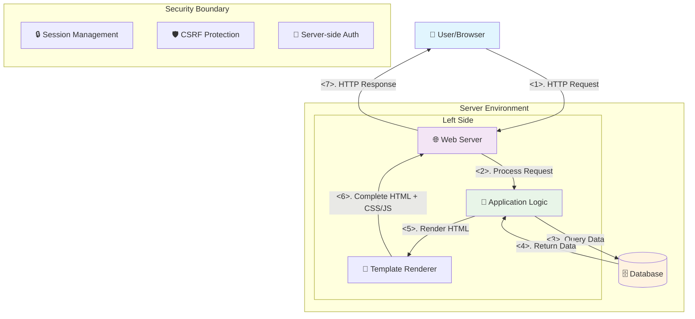

**Characteristics:**
- **Pros:** SEO-friendly, simple security model, fast initial load, works without JS
- **Cons:** Page reloads, limited interactivity, server coupling
- **Tech Examples:** Rails, Django, PHP, JSP, ASP.NET

---

### 2. SPA + Direct API

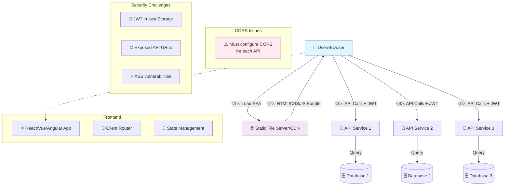

**Characteristics:**
- **Pros:** Rich user experience, client-side routing, responsive UI, clear separation
- **Cons:** CORS complexity, token management, SEO challenges, security exposure
- **Tech Examples:** React+REST, Vue+GraphQL, Angular+REST

---

### 3. BFF/Reverse Proxy Pattern

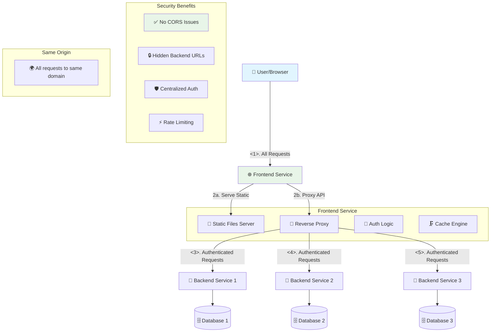

**Characteristics:**
- **Pros:** No CORS issues, hidden backend URLs, centralized security, token management
- **Cons:** Single point of failure, proxy complexity, additional latency
- **Tech Examples:** Nginx+SPA, Node.js Express, Spring Boot

---

### 4. API Gateway Pattern

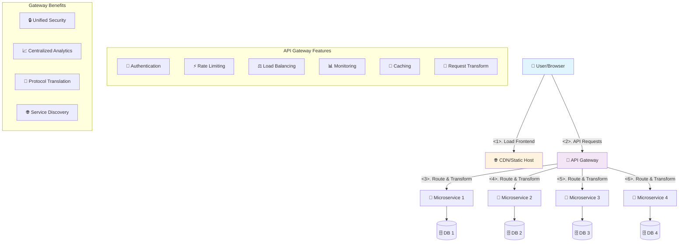

**Characteristics:**
- **Pros:** Service discovery, load balancing, centralized policies, monitoring
- **Cons:** Infrastructure overhead, network latency, gateway bottleneck
- **Tech Examples:** Kong, AWS API Gateway, Zuul, Spring Cloud Gateway

---

### 5. Micro-frontends Architecture

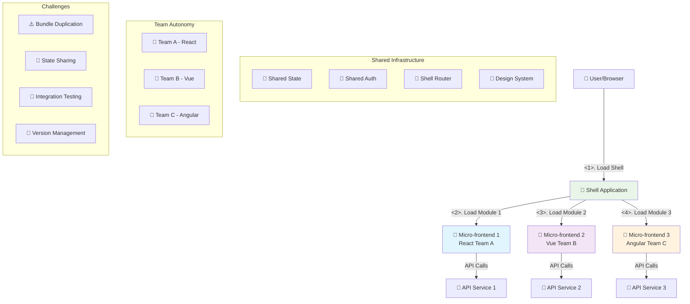

**Characteristics:**
- **Pros:** Team autonomy, technology diversity, independent deployments, scalable teams
- **Cons:** Integration complexity, shared state issues, bundle duplication
- **Tech Examples:** Module Federation, Single-SPA, Bit, Luigi

---

### 6. JAMstack Architecture

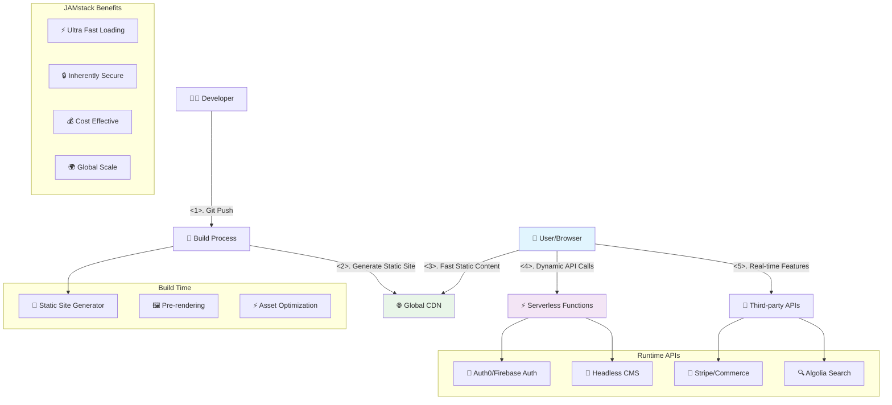

**Characteristics:**
- **Pros:** High performance, global CDN, cost-effective, developer experience
- **Cons:** Build-time limitations, dynamic content challenges, API dependency
- **Tech Examples:** Gatsby+Netlify, Next.js+Vercel, Nuxt+Netlify

---

### 7. SSR with Hydration (Universal/Isomorphic)

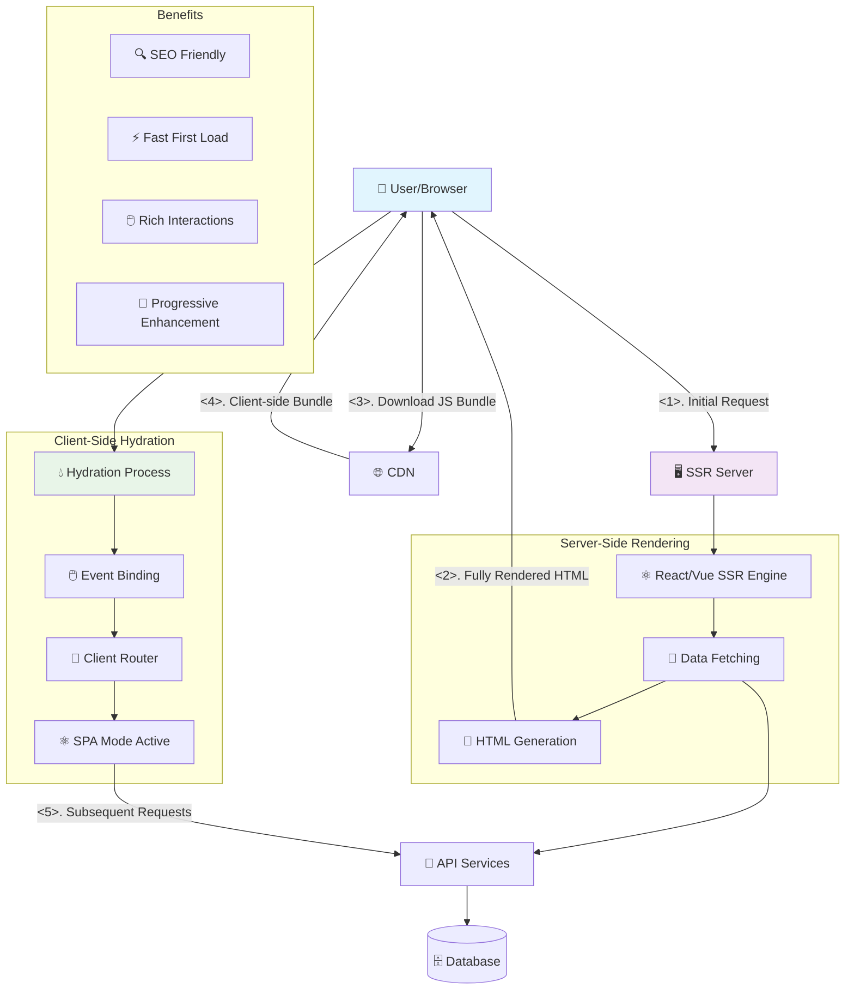

**Characteristics:**
- **Pros:** SEO benefits, fast initial load, progressive enhancement, rich interactions
- **Cons:** Complexity, hydration mismatches, memory usage
- **Tech Examples:** Next.js, Nuxt.js, SvelteKit, Remix

---

### 8. Edge Computing Architecture

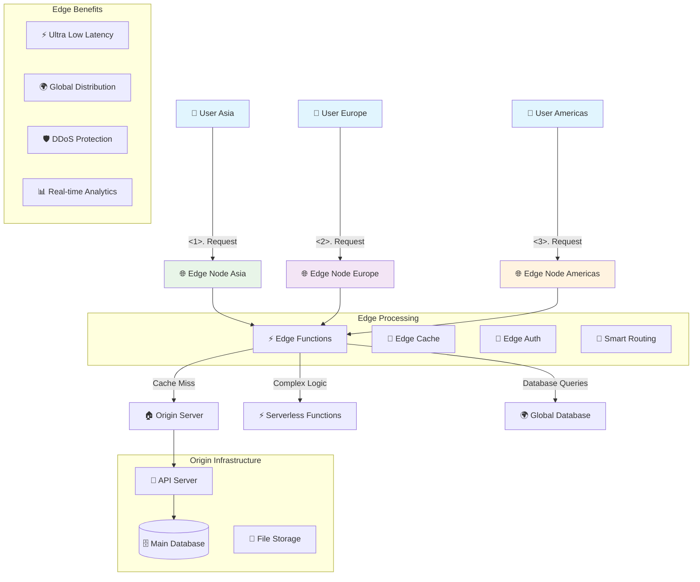

**Characteristics:**
- **Pros:** Ultra-low latency, global performance, reduced server load, regional compliance
- **Cons:** Limited runtime, cold start latency, debugging difficulty
- **Tech Examples:** Cloudflare Workers, AWS Lambda@Edge, Vercel Edge Functions

---

### 9. GraphQL Federation

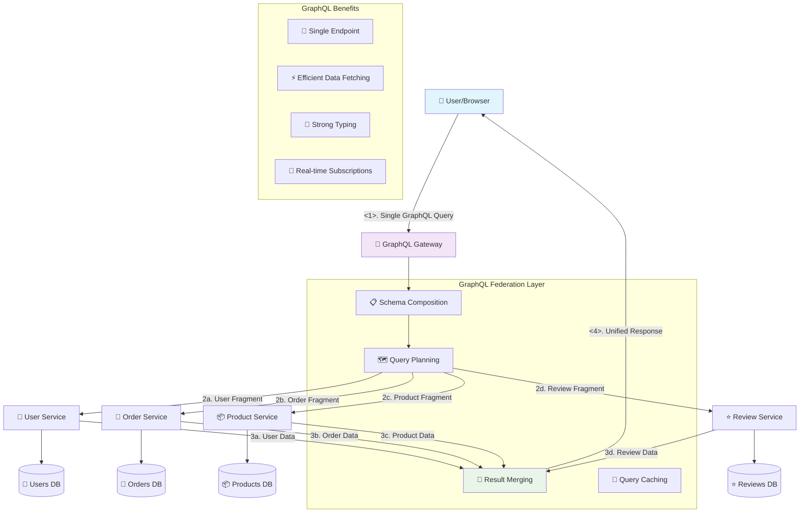

**Characteristics:**
- **Pros:** Single endpoint, efficient data fetching, strong typing, real-time subscriptions
- **Cons:** Query complexity, caching challenges, learning curve
- **Tech Examples:** Apollo Federation, GraphQL Mesh, Hasura

---

### 10. Event-Driven Architecture

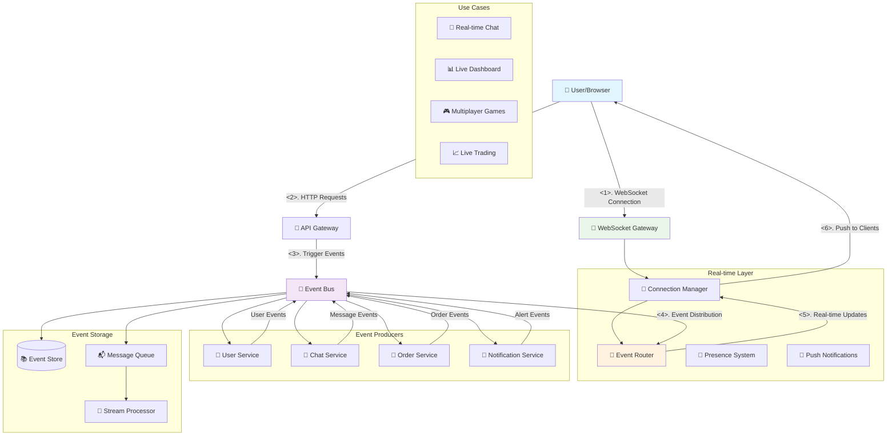

**Characteristics:**
- **Pros:** Real-time updates, scalable messaging, loose coupling, reactive UIs
- **Cons:** State synchronization, connection management, debugging complexity
- **Tech Examples:** Socket.io, WebSockets, Server-Sent Events, Redis Pub/Sub

---

## Comparison Tables

### Frontend-Backend Architecture Patterns Detailed Comparison

| **Pattern** | **Architecture** | **Security Model** | **Pros** | **Cons** | **Best Use Cases** | **Tech Examples** | **Complexity** |
|-------------|------------------|-------------------|----------|----------|-------------------|-------------------|----------------|
| **Traditional SSR** | Server renders HTML + CSS/JS | Session-based auth, CSRF protection | • SEO-friendly • Simple security model • Fast initial load • Works without JS | • Page reloads • Limited interactivity • Server coupling | Content-heavy sites, blogs, e-commerce | Rails, Django, PHP, JSP | ⭐⭐ |
| **SPA + Direct API** | Frontend calls APIs directly | JWT/OAuth, CORS handling | • Rich user experience • Client-side routing • Responsive UI • Clear separation | • CORS complexity • Token management • SEO challenges • Security exposure | Dashboards, admin panels, internal tools | React+REST, Vue+GraphQL | ⭐⭐⭐ |
| **BFF/Reverse Proxy** | FE service proxies to BE services | Centralized auth, same-origin | • No CORS issues • Hidden backend URLs • Centralized security • Token management | • Single point of failure • Proxy complexity • Additional latency | Enterprise apps, microservices | Nginx+SPA, Node.js Express | ⭐⭐⭐ |
| **API Gateway** | Dedicated gateway layer | Gateway-level auth, rate limiting | • Service discovery • Load balancing • Centralized policies • Monitoring | • Infrastructure overhead • Network latency • Gateway bottleneck | Microservices, large scale | Kong, AWS API Gateway, Zuul | ⭐⭐⭐⭐ |
| **Micro-frontends** | Multiple FE apps + shared shell | Distributed auth, federated | • Team autonomy • Technology diversity • Independent deployments • Scalable teams | • Integration complexity • Shared state issues • Bundle duplication | Large organizations, multiple teams | Module Federation, Single-SPA | ⭐⭐⭐⭐⭐ |
| **JAMstack** | Static site + serverless APIs | API-based auth, CDN security | • High performance • Global CDN • Cost-effective • Developer experience | • Build-time limitations • Dynamic content challenges • API dependency | Blogs, marketing sites, documentation | Gatsby+Netlify, Next.js+Vercel | ⭐⭐ |
| **SSR with Hydration** | Server renders + client hydrates | Hybrid auth (server + client) | • SEO benefits • Fast initial load • Progressive enhancement • Rich interactions | • Complexity • Hydration mismatches • Memory usage | E-commerce, content+app hybrids | Next.js, Nuxt.js, SvelteKit | ⭐⭐⭐⭐ |
| **Edge Computing** | Processing at CDN edge | Edge-level security, geo-distribution | • Ultra-low latency • Global performance • Reduced server load • Regional compliance | • Limited runtime • Cold start latency • Debugging difficulty | Global apps, real-time features | Cloudflare Workers, AWS Lambda@Edge | ⭐⭐⭐⭐ |
| **GraphQL Federation** | Unified schema across services | Schema-level auth, field permissions | • Single endpoint • Efficient data fetching • Strong typing • Real-time subscriptions | • Query complexity • Caching challenges • Learning curve | Data-heavy apps, mobile APIs | Apollo Federation, GraphQL Mesh | ⭐⭐⭐⭐ |
| **Event-Driven** | Real-time communication via events | Connection-based auth, message filtering | • Real-time updates • Scalable messaging • Loose coupling • Reactive UIs | • State synchronization • Connection management • Debugging complexity | Chat apps, live dashboards, gaming | Socket.io, WebSockets, Server-Sent Events | ⭐⭐⭐⭐ |

### Security Comparison

| **Pattern** | **Authentication** | **Authorization** | **Data Protection** | **Attack Vectors** | **Security Rating** |
|-------------|-------------------|-------------------|-------------------|-------------------|-------------------|
| **Traditional SSR** | Sessions, cookies | Server-side ACL | HTTPS, CSRF tokens | XSS, CSRF, injection | 🛡️🛡️🛡️🛡️ |
| **SPA + Direct API** | JWT, OAuth 2.0 | Client-side checks + API validation | HTTPS, token refresh | XSS, token theft, CORS | 🛡️🛡️🛡️ |
| **BFF/Reverse Proxy** | Proxy-managed auth | Centralized policies | HTTPS, HttpOnly cookies | Proxy vulnerabilities, SSRF | 🛡️🛡️🛡️🛡️ |
| **API Gateway** | Gateway-level auth | Fine-grained policies | End-to-end encryption | Gateway compromise, DDoS | 🛡️🛡️🛡️🛡️🛡️ |
| **Micro-frontends** | Federated identity | Distributed authorization | Encrypted inter-service communication | Shared dependencies, auth complexity | 🛡️🛡️🛡️ |
| **JAMstack** | API-based auth | Serverless function validation | CDN + API security | API exposure, build-time secrets | 🛡️🛡️🛡️ |
| **SSR with Hydration** | Hybrid auth flow | Server + client validation | Secure hydration | Hydration attacks, state leakage | 🛡️🛡️🛡️🛡️ |
| **Edge Computing** | Edge-level auth | Regional policies | Data locality compliance | Edge vulnerabilities, cold start attacks | 🛡️🛡️🛡️🛡️ |
| **GraphQL Federation** | Schema-level auth | Field-level permissions | Query depth limiting | Query complexity attacks, schema stitching | 🛡️🛡️🛡️ |
| **Event-Driven** | Connection auth | Message-level filtering | Encrypted channels | Message injection, connection hijacking | 🛡️🛡️🛡️ |

### Performance & Scalability Comparison

| **Pattern** | **Initial Load** | **Runtime Performance** | **Scalability** | **Caching Strategy** | **Development Speed** |
|-------------|------------------|----------------------|-----------------|-------------------|-------------------|
| **Traditional SSR** | ⚡⚡⚡⚡ | ⚡⚡ | ⚡⚡⚡ | Server-side caching | 🚀🚀🚀🚀 |
| **SPA + Direct API** | ⚡⚡ | ⚡⚡⚡⚡ | ⚡⚡⚡⚡ | Browser + API caching | 🚀🚀🚀 |
| **BFF/Reverse Proxy** | ⚡⚡⚡ | ⚡⚡⚡ | ⚡⚡⚡ | Proxy-level caching | 🚀🚀 |
| **API Gateway** | ⚡⚡⚡ | ⚡⚡⚡ | ⚡⚡⚡⚡⚡ | Gateway caching | 🚀🚀 |
| **Micro-frontends** | ⚡⚡ | ⚡⚡⚡ | ⚡⚡⚡⚡⚡ | Distributed caching | 🚀 |
| **JAMstack** | ⚡⚡⚡⚡⚡ | ⚡⚡⚡⚡ | ⚡⚡⚡⚡⚡ | CDN edge caching | 🚀🚀🚀🚀 |
| **SSR with Hydration** | ⚡⚡⚡⚡ | ⚡⚡⚡⚡ | ⚡⚡⚡⚡ | Hybrid caching | 🚀🚀 |
| **Edge Computing** | ⚡⚡⚡⚡⚡ | ⚡⚡⚡⚡⚡ | ⚡⚡⚡⚡⚡ | Global edge caching | 🚀 |
| **GraphQL Federation** | ⚡⚡⚡ | ⚡⚡⚡⚡ | ⚡⚡⚡⚡ | Query result caching | 🚀🚀 |
| **Event-Driven** | ⚡⚡⚡ | ⚡⚡⚡⚡⚡ | ⚡⚡⚡⚡⚡ | Event stream caching | 🚀 |

---

## Technical Abbreviations & Terms

### Frontend/UI Terms

| **Abbreviation** | **Full Name** | **Explanation** | **Example** |
|------------------|---------------|-----------------|-------------|
| **SPA** | Single Page Application | Web app that loads once and updates content dynamically | Gmail, Facebook, Twitter |
| **SSR** | Server-Side Rendering | Server generates HTML before sending to browser | Traditional websites, Next.js |
| **UI** | User Interface | What users see and interact with | Buttons, forms, menus |
| **CSS** | Cascading Style Sheets | Language for styling web pages | `color: blue; font-size: 16px;` |
| **JS** | JavaScript | Programming language for web interactivity | `alert('Hello World!')` |
| **HTML** | HyperText Markup Language | Markup language for web page structure | `<h1>Title</h1>` |
| **SEO** | Search Engine Optimization | Making websites findable by Google/Bing | Meta tags, structured data |

### Backend/API Terms

| **Abbreviation** | **Full Name** | **Explanation** | **Example** |
|------------------|---------------|-----------------|-------------|
| **API** | Application Programming Interface | Way for software to communicate | REST endpoints, GraphQL |
| **REST** | Representational State Transfer | Web API architectural style | `GET /users/123` |
| **GraphQL** | Graph Query Language | Query language for APIs | `{ user(id: 123) { name email } }` |
| **BFF** | Backend for Frontend | Service layer tailored for specific frontend | Mobile API vs Web API |
| **JWT** | JSON Web Token | Secure way to transmit information | `eyJhbGciOiJIUzI1NiIs...` |
| **OAuth** | Open Authorization | Standard for secure API access | "Login with Google" |
| **JSP** | JavaServer Pages | Java technology for dynamic web pages | `<%= user.getName() %>` |
| **PHP** | PHP: Hypertext Preprocessor | Server-side scripting language | `<?php echo "Hello"; ?>` |

### Security Terms

| **Abbreviation** | **Full Name** | **Explanation** | **Example** |
|------------------|---------------|-----------------|-------------|
| **CORS** | Cross-Origin Resource Sharing | Browser security for cross-domain requests | Allowing API calls from different domains |
| **CSRF** | Cross-Site Request Forgery | Attack using authenticated user's session | Malicious form submission |
| **XSS** | Cross-Site Scripting | Injecting malicious scripts into web pages | `` |
| **SSRF** | Server-Side Request Forgery | Server makes requests to unintended locations | Internal network access |
| **DDoS** | Distributed Denial of Service | Overwhelming server with traffic | 1000s of requests per second |
| **ACL** | Access Control List | List of permissions for resources | User can read, admin can write |

### Infrastructure Terms

| **Abbreviation** | **Full Name** | **Explanation** | **Example** |
|------------------|---------------|-----------------|-------------|
| **CDN** | Content Delivery Network | Global network of servers for fast content | Cloudflare, AWS CloudFront |
| **JAMstack** | JavaScript, APIs, and Markup | Modern web architecture | Static site + serverless functions |
| **DevOps** | Development Operations | Culture combining dev and operations | CI/CD pipelines, automated deployments |
| **IoT** | Internet of Things | Connected devices and sensors | Smart thermostats, fitness trackers |

---

## Recommendations

### **Architecture Comparison Summary**

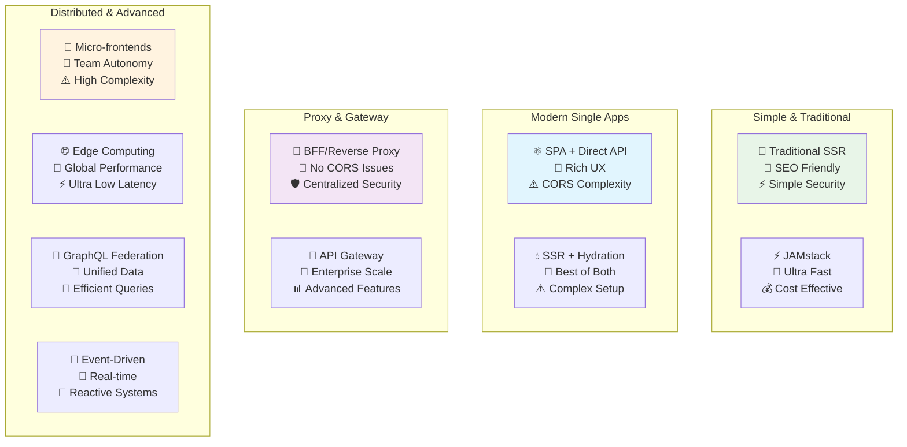

### **Decision Matrix**

#### **Choose Traditional SSR when:**
- SEO is critical
- Simple content-focused applications
- Small team with backend expertise
- Budget constraints

#### **Choose SPA + Direct API when:**
- Rich interactive experiences needed
- Clear API boundaries
- Modern development workflow
- Internal/authenticated applications

#### **Choose BFF/Reverse Proxy when:**
- Multiple backend services
- Need to hide service complexity
- Enterprise security requirements
- Gradual migration from monolith

#### **Choose API Gateway when:**
- Microservices architecture
- Multiple client types (mobile, web, IoT)
- Need advanced routing/policies
- High scalability requirements

#### **Choose Micro-frontends when:**
- Large organization with multiple teams
- Different technology preferences
- Independent release cycles needed
- Complex domain boundaries

#### **Choose JAMstack when:**
- Mostly static content with some dynamic features
- Global audience needing fast load times
- Cost optimization is important
- Simple deployment workflow desired

#### **Choose SSR with Hydration when:**
- Need both SEO and rich interactions
- E-commerce or content+application hybrid
- Modern framework ecosystem
- Progressive enhancement approach

#### **Choose Edge Computing when:**
- Global user base with latency requirements
- Real-time features needed
- Regional data compliance required
- High availability critical

#### **Choose GraphQL Federation when:**
- Complex data relationships across services
- Mobile applications needing efficient data fetching
- Strong typing requirements
- Multiple data sources to unify

#### **Choose Event-Driven when:**
- Real-time collaboration features
- Live dashboards or monitoring
- Chat or messaging applications
- Gaming or interactive experiences

---

This guide provides a comprehensive overview of modern frontend-backend architecture patterns with visual diagrams, detailed comparisons, and practical implementation guidance. Each pattern has its strengths and is suited for different use cases, team sizes, and technical requirements. 