# Micro-frontends Architecture Deep Dive

*Breaking Down Frontend Monoliths, Just Like We Did with Backend*

---

## Table of Contents
1. [The Problem: Frontend Monoliths](#the-problem-frontend-monoliths)
2. [What Are Micro-frontends?](#what-are-micro-frontends)
3. [Micro-frontends vs Microservices](#micro-frontends-vs-microservices)
4. [Micro-frontends vs Traditional Component Architecture](#micro-frontends-vs-traditional-component-architecture)
5. [How Micro-frontends Work](#how-micro-frontends-work)
6. [Real-World Examples](#real-world-examples)
7. [Implementation Approaches](#implementation-approaches)
8. [Pros and Cons](#pros-and-cons)
9. [When to Use Micro-frontends](#when-to-use-micro-frontends)

---

## The Problem: Frontend Monoliths

### **The Growth Pain Story**
Imagine you're working at a growing company. Your frontend started simple:

**Year 1: Small Team (3 developers)**
```mermaid
graph TD
    DEV1[👨‍💻 Developer 1] --> APP[📱 React App]
    DEV2[👨‍💻 Developer 2] --> APP
    DEV3[👨‍💻 Developer 3] --> APP
    
    APP --> HEADER[🧩 Header]
    APP --> SIDEBAR[🧩 Sidebar] 
    APP --> CONTENT[🧩 Content]
    
    style APP fill:#e1f5fe
    style HEADER fill:#f3e5f5
```

**Year 3: Medium Team (15 developers)**
```mermaid
graph TD
    TEAM1[👥 Team 1<br/>5 devs] --> APP[📱 Monolithic Frontend]
    TEAM2[👥 Team 2<br/>5 devs] --> APP
    TEAM3[👥 Team 3<br/>5 devs] --> APP
    
    APP --> MANY[🧩🧩🧩🧩🧩<br/>50+ Components]
    
    subgraph "Shared Codebase Problems"
        CONFLICTS[⚠️ Merge Conflicts]
        DEPENDENCIES[⚠️ Shared Dependencies]
        COORDINATION[⚠️ Release Coordination]
    end
    
    style APP fill:#ffebee
    style CONFLICTS fill:#ffcdd2
```

**Year 5: Large Organization (50+ developers)**
```mermaid
graph TD
    TEAM1[👥 Header Team<br/>8 devs] --> APP[📱 MASSIVE Frontend]
    TEAM2[👥 Dashboard Team<br/>12 devs] --> APP
    TEAM3[👥 Settings Team<br/>6 devs] --> APP
    TEAM4[👥 Reports Team<br/>10 devs] --> APP
    TEAM5[👥 Admin Team<br/>8 devs] --> APP
    TEAM6[👥 Mobile Team<br/>6 devs] --> APP
    
    APP --> NIGHTMARE[😱 Deployment Nightmare<br/>🐛 Bug Dependencies<br/>📦 Bundle Size Issues<br/>🔄 Technology Lock-in]
    
    style APP fill:#d32f2f
    style NIGHTMARE fill:#ffcdd2
```

### **Common Frontend Monolith Problems**

| **Problem** | **Example** | **Impact** |
|-------------|-------------|------------|
| **Merge Conflicts** | 5 teams editing the same routing file | Developers spend hours resolving conflicts |
| **Shared Dependencies** | Team A needs React 18, Team B stuck on 16 | Technology innovation blocked |
| **Deployment Coordination** | Can't release header changes without testing everything | Slower release cycles |
| **Bundle Size** | All teams' code shipped to all users | Poor performance for simple pages |
| **Technology Lock-in** | Entire app must use same framework/version | Can't experiment with new technologies |
| **Testing Complexity** | Must test entire app for small changes | Longer CI/CD pipelines |

---

## What Are Micro-frontends?

### **The Core Concept**
Micro-frontends apply **microservices principles** to frontend development:

> **"An architectural style where independently deliverable frontend applications are composed into a greater whole"**

### **Visual Comparison: Before and After**

**Before: Monolithic Frontend**


**After: Micro-frontends**
```mermaid
graph TD
    USER[👤 User] --> SHELL[🐚 Shell Application]
    
    SHELL --> MF1[🧩 Header Micro-frontend<br/>Team A owns]
    SHELL --> MF2[🧩 Dashboard Micro-frontend<br/>Team B owns]
    SHELL --> MF3[🧩 Settings Micro-frontend<br/>Team C owns]
    
    MF1 --> REPO1[📁 Separate Repo<br/>Independent Deploy]
    MF2 --> REPO2[📁 Separate Repo<br/>Independent Deploy]
    MF3 --> REPO3[📁 Separate Repo<br/>Independent Deploy]
    
    subgraph "Team Autonomy"
        REPO1
        REPO2
        REPO3
    end
    
    style SHELL fill:#e8f5e8
    style MF1 fill:#e1f5fe
    style MF2 fill:#f3e5f5
    style MF3 fill:#fff3e0
```

---

## Micro-frontends vs Microservices

This is the most important comparison because **micro-frontends directly copy the microservices playbook**.

### **Side-by-Side Comparison**

| **Aspect** | **Microservices (Backend)** | **Micro-frontends (Frontend)** |
|------------|-----------------------------|---------------------------------|
| **Unit of Deployment** | Individual service | Individual frontend app |
| **Team Ownership** | Service per team | Frontend section per team |
| **Technology Freedom** | Different languages/frameworks per service | Different frameworks per micro-frontend |
| **Communication** | APIs, message queues | Events, shared state, routing |
| **Data Storage** | Database per service | Local state per micro-frontend |
| **Integration Point** | API Gateway | Shell application |
| **Independence** | Deploy without affecting others | Deploy without affecting others |

### **Architecture Diagrams**

**Microservices Architecture:**
```mermaid
graph TD
    CLIENT[📱 Client] --> GATEWAY[🚪 API Gateway]
    
    GATEWAY --> SVC1[🔌 User Service<br/>Team A]
    GATEWAY --> SVC2[🔌 Order Service<br/>Team B]
    GATEWAY --> SVC3[🔌 Payment Service<br/>Team C]
    
    SVC1 --> DB1[(👥 User DB)]
    SVC2 --> DB2[(📦 Order DB)]
    SVC3 --> DB3[(💳 Payment DB)]
    
    subgraph "Independent Services"
        SVC1
        SVC2
        SVC3
    end
    
    style GATEWAY fill:#f3e5f5
    style SVC1 fill:#e1f5fe
```

**Micro-frontends Architecture:**
```mermaid
graph TD
    USER[👤 User] --> SHELL[🐚 Shell App]
    
    SHELL --> MF1[🧩 User Profile MF<br/>Team A]
    SHELL --> MF2[🧩 Order History MF<br/>Team B]
    SHELL --> MF3[🧩 Payment Settings MF<br/>Team C]
    
    MF1 --> API1[🔌 User API]
    MF2 --> API2[🔌 Order API]
    MF3 --> API3[🔌 Payment API]
    
    subgraph "Independent Frontends"
        MF1
        MF2
        MF3
    end
    
    style SHELL fill:#e8f5e8
    style MF1 fill:#e1f5fe
```

### **Key Insights from the Comparison**

1. **Same Philosophy**: Both break large monoliths into smaller, manageable pieces
2. **Team Alignment**: Both align technology boundaries with team boundaries
3. **Independence**: Both enable teams to deploy without coordination
4. **Complexity Trade-off**: Both add infrastructure complexity for team autonomy

**The Shell Application** acts like an **API Gateway** for frontends - it routes requests and coordinates communication between micro-frontends.

---

## Micro-frontends vs Traditional Component Architecture

This comparison shows the **evolution** from component-based SPAs to micro-frontends.

### **Traditional Component Architecture (React/Vue/Angular)**

```mermaid
graph TD
    APP[📱 Single Page Application] --> COMP1[🧩 Header Component]
    APP --> COMP2[🧩 Sidebar Component]
    APP --> COMP3[🧩 Dashboard Component]
    APP --> COMP4[🧩 Settings Component]
    
    subgraph "Shared Infrastructure"
        ROUTER[🧭 Single Router]
        STATE[💾 Shared State Management]
        DEPS[📦 Shared Dependencies]
        BUILD[🔨 Single Build Process]
    end
    
    style APP fill:#e1f5fe
    style COMP1 fill:#f3e5f5
```

### **Micro-frontends Architecture**

```mermaid
graph TD
    SHELL[🐚 Shell Application] --> MF1[🧩 Header Micro-frontend]
    SHELL --> MF2[🧩 Dashboard Micro-frontend]
    SHELL --> MF3[🧩 Settings Micro-frontend]
    
    MF1 --> INFRA1[Own Router<br/>Own State<br/>Own Dependencies<br/>Own Build]
    MF2 --> INFRA2[Own Router<br/>Own State<br/>Own Dependencies<br/>Own Build]
    MF3 --> INFRA3[Own Router<br/>Own State<br/>Own Dependencies<br/>Own Build]
    
    subgraph "Independent Infrastructure"
        INFRA1
        INFRA2
        INFRA3
    end
    
    style SHELL fill:#e8f5e8
    style MF1 fill:#e1f5fe
```

### **Key Differences**

| **Traditional Components** | **Micro-frontends** |
|---------------------------|---------------------|
| **Scope**: UI reusability | **Scope**: Business domain ownership |
| **Sharing**: Shared dependencies | **Sharing**: Independent dependencies |
| **Communication**: Direct function calls | **Communication**: Events, props, routing |
| **Deployment**: All together | **Deployment**: Independent |
| **Teams**: Shared codebase | **Teams**: Separate codebases |
| **Technology**: Must use same framework | **Technology**: Can use different frameworks |

### **Example: E-commerce Application**

**Traditional Component Approach:**
```javascript
// Single React app with components
function EcommerceApp() {
    return (
        <div>
            <Header />           {/* React component */}
            <ProductList />      {/* React component */}
            <ShoppingCart />     {/* React component */}
            <UserProfile />      {/* React component */}
        </div>
    );
}
```

**Micro-frontends Approach:**
```javascript
// Shell app that loads micro-frontends
function EcommerceShell() {
    return (
        <div>
            <HeaderMF />         {/* Separate React app */}
            <ProductListMF />    {/* Separate Vue app */}
            <ShoppingCartMF />   {/* Separate Angular app */}
            <UserProfileMF />    {/* Separate Svelte app */}
        </div>
    );
}
```

---

## How Micro-frontends Work

### **Runtime Integration Approaches**

#### **1. Client-Side Composition**
```mermaid
graph TD
    USER[👤 User] --> SHELL[🐚 Shell App]
    SHELL -->|Load at Runtime| MF1[🧩 Header MF]
    SHELL -->|Load at Runtime| MF2[🧩 Content MF]
    
    MF1 --> JS1[📄 header.js]
    MF2 --> JS2[📄 content.js]
    
    subgraph "Browser Runtime"
        SHELL
        MF1
        MF2
    end
    
    style SHELL fill:#e8f5e8
    style MF1 fill:#e1f5fe
```

**Example Implementation:**
```javascript
// Shell application
class MicrofrontendLoader {
    async loadMicrofrontend(name, url) {
        // Load micro-frontend JavaScript bundle
        const script = document.createElement('script');
        script.src = url;
        document.head.appendChild(script);
        
        // Wait for micro-frontend to register itself
        return new Promise((resolve) => {
            window[`${name}Ready`] = resolve;
        });
    }
}

// Usage
const loader = new MicrofrontendLoader();
await loader.loadMicrofrontend('header', '/header-mf/main.js');
await loader.loadMicrofrontend('dashboard', '/dashboard-mf/main.js');
```

#### **2. Build-Time Composition**
```mermaid
graph TD
    BUILD[🔨 Build Process] --> MF1[🧩 Header MF]
    BUILD --> MF2[🧩 Dashboard MF]
    BUILD --> MF3[🧩 Settings MF]
    
    BUILD --> BUNDLE[📦 Combined Bundle]
    BUNDLE --> CDN[🌐 CDN]
    CDN --> USER[👤 User]
    
    style BUILD fill:#f3e5f5
    style BUNDLE fill:#e8f5e8
```

#### **3. Server-Side Composition**


### **Communication Between Micro-frontends**

#### **1. Custom Events**
```javascript
// Micro-frontend A: Send event
window.dispatchEvent(new CustomEvent('user-logged-in', {
    detail: { userId: 123, userName: 'John' }
}));

// Micro-frontend B: Listen for event
window.addEventListener('user-logged-in', (event) => {
    console.log('User logged in:', event.detail);
    updateUI(event.detail);
});
```

#### **2. Shared State Store**
```javascript
// Shared state store (loaded by shell)
class SharedStore {
    constructor() {
        this.state = {};
        this.listeners = [];
    }
    
    setState(key, value) {
        this.state[key] = value;
        this.notifyListeners(key, value);
    }
    
    subscribe(key, callback) {
        this.listeners.push({ key, callback });
    }
}

// Micro-frontend usage
window.sharedStore.setState('currentUser', { id: 123 });
window.sharedStore.subscribe('currentUser', (user) => {
    console.log('User changed:', user);
});
```

#### **3. URL/Routing**
```javascript
// Micro-frontend navigation
function navigateTo(path) {
    window.history.pushState({}, '', path);
    window.dispatchEvent(new PopStateEvent('popstate'));
}

// Shell handles routing
window.addEventListener('popstate', () => {
    const path = window.location.pathname;
    if (path.startsWith('/dashboard')) {
        loadMicrofrontend('dashboard');
    } else if (path.startsWith('/settings')) {
        loadMicrofrontend('settings');
    }
});
```

---

## Real-World Examples

### **Spotify: Micro-frontends Pioneer**

Spotify was one of the first companies to successfully implement micro-frontends at scale.

```mermaid
graph TD
    USER[👤 Spotify User] --> SHELL[🐚 Spotify Shell]
    
    SHELL --> SIDEBAR[🧩 Sidebar MF<br/>Navigation Team]
    SHELL --> PLAYER[🧩 Player MF<br/>Playback Team]
    SHELL --> MAIN[🧩 Main Content MF<br/>Content Team]
    SHELL --> SEARCH[🧩 Search MF<br/>Discovery Team]
    
    subgraph "Team Ownership"
        T1[👥 Navigation Team<br/>- Owns sidebar<br/>- React + Redux<br/>- Independent deploys]
        T2[👥 Playback Team<br/>- Owns player<br/>- Vue.js<br/>- Real-time updates]
        T3[👥 Content Team<br/>- Owns main content<br/>- Angular<br/>- Content rendering]
    end
    
    style SHELL fill:#1db954
    style SIDEBAR fill:#e1f5fe
    style PLAYER fill:#f3e5f5
```

**Spotify's Benefits:**
- **150+ developers** working independently
- **Different technologies** per team (React, Vue, Angular)
- **Independent deployments** - teams deploy 20+ times per day
- **A/B testing** per micro-frontend
- **Faster feature development** - no coordination needed

### **IKEA: E-commerce Micro-frontends**


**IKEA's Implementation:**
- **Product teams** own their domain end-to-end
- **Gradual migration** from monolith to micro-frontends
- **Shared design system** ensures consistent UI
- **Performance optimization** - load only needed micro-frontends

### **Zalando: Fashion E-commerce**

```mermaid
graph TD
    USER[👤 Fashion Shopper] --> MOSAIC[🐚 Mosaic Framework]
    
    MOSAIC --> PRODUCT_DETAIL[🧩 Product Detail MF]
    MOSAIC --> RECOMMENDATIONS[🧩 Recommendations MF]
    MOSAIC --> REVIEWS[🧩 Reviews MF]
    MOSAIC --> SIZE_GUIDE[🧩 Size Guide MF]
    
    subgraph "Tailor Framework"
        FRAGMENTS[📦 Tailor Fragments]
        STREAMING[🌊 Streaming Composition]
        SSR[🖥️ Server-Side Rendering]
    end
    
    style MOSAIC fill:#ff6900
    style PRODUCT_DETAIL fill:#e1f5fe
```

**Zalando's Innovation:**
- **Tailor framework** for server-side composition
- **Fragment streaming** for progressive loading
- **SEO optimization** with server-side rendering
- **100+ micro-frontends** across different teams

---

## Implementation Approaches

### **1. Module Federation (Webpack 5)**

**The Modern Standard**
```javascript
// Shell application webpack config
const ModuleFederationPlugin = require('@module-federation/webpack');

module.exports = {
    plugins: [
        new ModuleFederationPlugin({
            name: 'shell',
            remotes: {
                header: 'header@http://localhost:3001/remoteEntry.js',
                dashboard: 'dashboard@http://localhost:3002/remoteEntry.js',
            },
        }),
    ],
};

// Using micro-frontends in shell
import('./bootstrap');

// bootstrap.js
const Header = React.lazy(() => import('header/Header'));
const Dashboard = React.lazy(() => import('dashboard/Dashboard'));

function App() {
    return (
        <div>
            <Suspense fallback={<div>Loading header...</div>}>
                <Header />
            </Suspense>
            <Suspense fallback={<div>Loading dashboard...</div>}>
                <Dashboard />
            </Suspense>
        </div>
    );
}
```

### **2. Single-SPA Framework**

**Multi-Framework Support**
```javascript
// Shell application
import { registerApplication, start } from 'single-spa';

// Register micro-frontends
registerApplication({
    name: '@org/header',
    app: () => import('@org/header'),
    activeWhen: ['/'],
});

registerApplication({
    name: '@org/dashboard',
    app: () => import('@org/dashboard'),
    activeWhen: ['/dashboard'],
});

start();

// React micro-frontend
import { registerApplication } from 'single-spa';

const reactLifecycles = singleSpaReact({
    React,
    ReactDOM,
    rootComponent: Header,
});

export const { bootstrap, mount, unmount } = reactLifecycles;
```

### **3. Web Components**

**Framework-Agnostic Approach**
```javascript
// Header micro-frontend as Web Component
class HeaderMicrofrontend extends HTMLElement {
    connectedCallback() {
        this.innerHTML = `
            <header>
                <nav>Navigation content here</nav>
            </header>
        `;
    }
}

customElements.define('header-mf', HeaderMicrofrontend);

// Usage in shell
function App() {
    return (
        <div>
            <header-mf></header-mf>
            <main>Main content</main>
        </div>
    );
}
```

### **4. iFrame-based (Simple but Limited)**

```html
<!-- Shell application -->
<div class="app">
    <iframe src="/header-mf/" height="100"></iframe>
    <iframe src="/dashboard-mf/" height="500"></iframe>
    <iframe src="/footer-mf/" height="80"></iframe>
</div>
```

**Comparison of Approaches:**

| **Approach** | **Complexity** | **Performance** | **Framework Freedom** | **SEO** | **Best For** |
|--------------|----------------|-----------------|---------------------|---------|--------------|
| **Module Federation** | Medium | High | Medium | Good | Modern SPAs |
| **Single-SPA** | Medium | High | High | Good | Multi-framework apps |
| **Web Components** | Low | High | High | Excellent | Standard-compliant apps |
| **iFrame** | Very Low | Low | High | Poor | Legacy integration |

---

## Pros and Cons

### **✅ Advantages**

#### **1. Team Autonomy**
```mermaid
graph TD
    TEAM1[👥 Team A] --> MF1[🧩 MF A<br/>✅ Own tech stack<br/>✅ Own release cycle<br/>✅ Own decisions]
    TEAM2[👥 Team B] --> MF2[🧩 MF B<br/>✅ Own tech stack<br/>✅ Own release cycle<br/>✅ Own decisions]
    
    MF1 -.->|Independent| MF2
    
    style MF1 fill:#c8e6c9
    style MF2 fill:#c8e6c9
```

- **Technology choice freedom**: Team A uses React, Team B uses Vue
- **Independent deployments**: No coordination needed
- **Faster development**: No merge conflicts or waiting for other teams

#### **2. Scalability**
- **Team scaling**: Add teams without slowing down existing ones
- **Performance scaling**: Load only needed micro-frontends
- **Technology scaling**: Upgrade frameworks incrementally

#### **3. Resilience**
- **Fault isolation**: One micro-frontend crash doesn't break others
- **Graceful degradation**: Missing micro-frontends can show fallbacks
- **Independent testing**: Test micro-frontends in isolation

### **❌ Disadvantages**

#### **1. Complexity**
```mermaid
graph TD
    SIMPLE[Simple SPA] --> COMPLEX[Micro-frontends]
    
    subgraph "New Complexities"
        INTEGRATION[🔧 Integration complexity]
        COMMUNICATION[📡 Inter-MF communication]
        COORDINATION[🎯 Design coordination]
        DEPLOYMENT[🚀 Multi-app deployment]
        MONITORING[📊 Distributed monitoring]
    end
    
    style SIMPLE fill:#c8e6c9
    style COMPLEX fill:#ffcdd2
```

#### **2. Performance Overhead**
- **Bundle duplication**: Multiple React versions loaded
- **Network requests**: More HTTP requests for loading MFs
- **Memory usage**: Multiple framework instances

#### **3. Development Challenges**
- **Local development**: Running multiple apps locally
- **Debugging**: Issues span multiple applications
- **Shared dependencies**: Managing common libraries
- **Testing**: Integration testing across MFs

### **Real Performance Impact Example**

**Traditional SPA Bundle:**
```
main.js: 500KB (React + all features)
Total: 500KB
```

**Micro-frontends Bundle:**
```
shell.js: 150KB (Shell + routing)
header.js: 120KB (React + header code)
dashboard.js: 180KB (React + dashboard code)
settings.js: 100KB (React + settings code)
Total: 550KB (but loaded progressively)
```

---

## When to Use Micro-frontends

### **✅ Good Fit For:**

#### **1. Large Organizations**


**Indicators:**
- **Multiple teams** working on frontend
- **Different domain expertise** per team
- **Coordination bottlenecks** in current setup
- **Technology diversity** needs

#### **2. Legacy Migration**
```mermaid
graph TD
    OLD[🏚️ Legacy Monolith] --> GRADUAL[🔄 Gradual Migration]
    
    GRADUAL --> STEP1[Step 1: Extract Header]
    GRADUAL --> STEP2[Step 2: Extract Dashboard]
    GRADUAL --> STEP3[Step 3: Extract Settings]
    
    STEP3 --> NEW[🏗️ Full Micro-frontends]
    
    style OLD fill:#ffcdd2
    style NEW fill:#c8e6c9
```

**Benefits:**
- **Risk reduction**: Migrate piece by piece
- **Business continuity**: Old and new coexist
- **Team learning**: Gradual adoption

#### **3. Diverse Technology Needs**
```mermaid
graph TD
    APP[📱 Application] --> REACT[🧩 React MF<br/>Complex UI interactions]
    APP --> VUE[🧩 Vue MF<br/>Data visualization]
    APP --> ANGULAR[🧩 Angular MF<br/>Enterprise features]
    APP --> VANILLA[🧩 Vanilla JS MF<br/>High performance widget]
    
    style APP fill:#e8f5e8
    style REACT fill:#61dafb
    style VUE fill:#4fc08d
    style ANGULAR fill:#dd1b16
```

### **❌ Poor Fit For:**

#### **1. Small Teams**
```mermaid
graph TD
    SMALL[👥 Small Team<br/>3-5 Developers] --> OVERHEAD[📊 High Overhead]
    
    OVERHEAD --> PROBLEMS[Problems]
    PROBLEMS --> COMPLEXITY[😰 Unnecessary complexity]
    PROBLEMS --> MAINTENANCE[🔧 More infrastructure to maintain]
    PROBLEMS --> LEARNING[📚 Learning curve for little benefit]
    
    style SMALL fill:#ffcdd2
    style OVERHEAD fill:#ff8a65
```

#### **2. Simple Applications**
- **CRUD applications**: Simple forms and data display
- **Marketing websites**: Mostly static content
- **Prototypes**: Need speed, not scalability

#### **3. Performance-Critical Applications**
- **Mobile-first**: Bundle size matters significantly
- **Low-bandwidth users**: Every KB counts
- **Real-time applications**: Latency sensitive

### **Decision Framework**

| **Question** | **Score for Micro-frontends** |
|--------------|-------------------------------|
| Do you have 15+ frontend developers? | +3 |
| Do you have multiple teams with different domain expertise? | +3 |
| Do teams need different technologies? | +2 |
| Is your current frontend becoming hard to maintain? | +2 |
| Do you need independent deployment cycles? | +2 |
| Is performance extremely critical? | -2 |
| Do you have a small team (< 8 developers)? | -3 |
| Is your application relatively simple? | -2 |

**Score Interpretation:**
- **6+**: Strong candidate for micro-frontends
- **3-5**: Consider micro-frontends with careful planning
- **0-2**: Probably stick with traditional architecture
- **Negative**: Definitely avoid micro-frontends

---

## Summary

### **Key Takeaways**

1. **Micro-frontends are the frontend version of microservices** - they solve similar organizational problems
2. **They're an evolution of component architecture**, not a replacement - components focus on reusability, micro-frontends focus on team ownership
3. **They're excellent for large organizations** but overkill for small teams
4. **The complexity trade-off is real** - you gain team autonomy but lose simplicity

### **The Evolution Path**

```mermaid
graph LR
    MONOLITH[🏚️ Frontend Monolith<br/>One team, one codebase] 
    COMPONENTS[🧩 Component Architecture<br/>Organized code, shared codebase]
    MICROFRONTENDS[🏗️ Micro-frontends<br/>Team ownership, separate codebases]
    
    MONOLITH -->|Add structure| COMPONENTS
    COMPONENTS -->|Add team boundaries| MICROFRONTENDS
    
    style MONOLITH fill:#ffcdd2
    style COMPONENTS fill:#fff3e0
    style MICROFRONTENDS fill:#c8e6c9
```

**Most applications should follow this progression:**
1. **Start simple** with a well-structured monolith
2. **Add component architecture** for better organization
3. **Consider micro-frontends** only when team coordination becomes a bottleneck

Micro-frontends are a powerful pattern, but like microservices, they're a solution to **organizational problems**, not technical ones. Use them when your team structure demands it, not because they're the latest trend! 