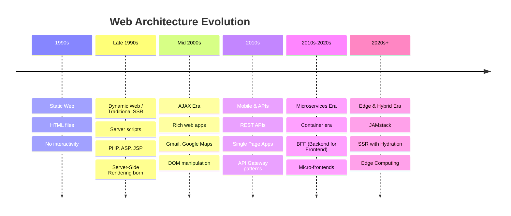
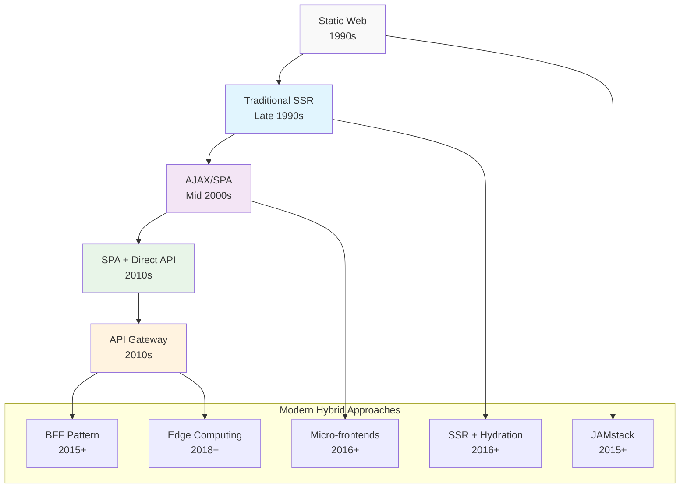

# The Evolution of Web Architecture: A Historical Journey

*From Static Pages to Modern Distributed Systems*

---

## Table of Contents
1. [The Early Web Era (1990s)](#the-early-web-era-1990s)
2. [The Dynamic Web Revolution (Late 1990s - Early 2000s)](#the-dynamic-web-revolution-late-1990s---early-2000s)
3. [The AJAX & Rich Web Era (Mid 2000s)](#the-ajax--rich-web-era-mid-2000s)
4. [The Mobile & API Economy (2010s)](#the-mobile--api-economy-2010s)
5. [The Cloud & Microservices Era (2010s-2020s)](#the-cloud--microservices-era-2010s-2020s)
6. [The Modern Edge & Real-time Era (2020s+)](#the-modern-edge--real-time-era-2020s)
7. [Timeline Summary](#timeline-summary)

---

## The Early Web Era (1990s)

### **The Problem: Information Sharing**
In the early 1990s, Tim Berners-Lee wanted to solve a simple problem: how to share documents between researchers at CERN. The internet existed, but there was no easy way to link and navigate between documents.

### **The Solution: Static Web Pages**

```mermaid
graph TD
    USER[👤 User] -->|<1>. Request HTML| SERVER[🖥️ Web Server]
    SERVER -->|<2>. Send HTML File| USER
    
    subgraph "Web Server"
        HTML[📄 Static HTML Files]
        CSS[🎨 CSS Files]
        IMAGES[🖼️ Image Files]
    end
    
    style USER fill:#e1f5fe
    style SERVER fill:#f3e5f5
```



**How it worked:**
- Web servers simply served static HTML files
- No databases, no dynamic content
- Each page was a separate `.html` file on the server
- Links connected pages together

**Example of early web:**
```html
<!-- index.html -->
<html>
<head><title>John's Homepage</title></head>
<body>
    <h1>Welcome to my homepage!</h1>
    <p>Here are my research papers:</p>
    <a href="paper1.html">My First Paper</a>
</body>
</html>
```

**Characteristics:**
- ✅ **Simple**: Easy to understand and deploy
- ✅ **Fast**: No processing needed, just file serving
- ✅ **Reliable**: Nothing could break
- ❌ **Static**: Content couldn't change without manual editing
- ❌ **No Interactivity**: Users couldn't submit forms or interact

**Key Technologies:**
- HTML (HyperText Markup Language)
- HTTP (HyperText Transfer Protocol)
- Web servers like Apache, IIS

---

## The Dynamic Web Revolution (Late 1990s - Early 2000s)

### **The Problem: Need for Dynamic Content**
As the web grew, people wanted:
- User-submitted content (guestbooks, forums)
- Personalized experiences
- E-commerce (shopping carts, user accounts)
- Content that could change without manual file editing

### **The Solution: Server-Side Processing**

```mermaid
graph TD
    USER[👤 User] -->|<1>. Request Page| SERVER[🖥️ Web Server]
    SERVER -->|<2>. Execute Script| SCRIPT[📜 Server Script]
    SCRIPT -->|<3>. Query Data| DB[(🗄️ Database)]
    DB -->|<4>. Return Data| SCRIPT
    SCRIPT -->|<5>. Generate HTML| SERVER
    SERVER -->|<6>. Send Dynamic HTML| USER
    
    subgraph "Server Technologies"
        SCRIPT
        DB
    end
    
    style USER fill:#e1f5fe
    style SERVER fill:#f3e5f5
    style SCRIPT fill:#e8f5e8
    style DB fill:#fff3e0
```



**How it worked:**
- Server-side scripts (PHP, ASP, JSP) processed requests
- Scripts connected to databases to store/retrieve data
- HTML was generated dynamically for each request
- Forms allowed user input

> **📍 This is where Traditional SSR (Server-Side Rendering) patterns were born!** Every request generated a complete HTML page on the server. This approach continued to evolve and is still used today in frameworks like Next.js, Nuxt.js, and server-side React.

**Example of dynamic web:**
```php
<!-- userlist.php -->
<?php
    $users = mysql_query("SELECT * FROM users");
    echo "<h1>Our Users</h1>";
    while($user = mysql_fetch_array($users)) {
        echo "<p>Welcome " . $user['name'] . "!</p>";
    }
?>
```

**Major Innovations:**
1. **CGI (Common Gateway Interface)** - First way to run programs on web servers
2. **PHP, ASP, JSP** - Easier server-side programming
3. **Databases** - MySQL, PostgreSQL for data storage
4. **Sessions & Cookies** - Remember users between visits

**Characteristics:**
- ✅ **Dynamic**: Content could change based on data
- ✅ **Interactive**: Users could submit forms
- ✅ **Personalized**: Different content for different users
- ❌ **Page Reloads**: Every interaction required full page refresh
- ❌ **Server Load**: All processing happened on server

**Key Players & Technologies:**
- **Languages**: PHP, Perl, ASP (Microsoft), JSP (Java)
- **Databases**: MySQL, Oracle, SQL Server
- **Frameworks**: Early CMS systems like WordPress (2003)

---

## The AJAX & Rich Web Era (Mid 2000s)

### **The Problem: Poor User Experience**
By the mid-2000s, users were frustrated with:
- Full page reloads for every action
- Slow, clunky interfaces compared to desktop apps
- Loss of scroll position and form data during navigation
- Gmail and Google Maps showed what was possible with AJAX

### **The Solution: Asynchronous JavaScript**

```mermaid
graph TD
    USER[👤 User] -->|<1>. Interact with Page| JS[⚡ JavaScript]
    JS -->|<2>. AJAX Request| SERVER[🖥️ Server]
    SERVER -->|<3>. Process Request| SCRIPT[📜 Server Script]
    SCRIPT -->|<4>. Query Database| DB[(🗄️ Database)]
    DB -->|<5>. Return Data| SCRIPT
    SCRIPT -->|<6>. JSON/XML Response| SERVER
    SERVER -->|<7>. Data Only| JS
    JS -->|<8>. Update Page| USER
    
    subgraph "Browser"
        JS
        DOM[🌐 DOM Manipulation]
    end
    
    subgraph "Server Side"
        SCRIPT
        DB
    end
    
    style USER fill:#e1f5fe
    style JS fill:#fff3e0
    style SERVER fill:#f3e5f5
    style DB fill:#e8f5e8
```



**How it worked:**
- JavaScript running in the browser made background requests
- Server returned data (JSON/XML) instead of full HTML pages
- JavaScript updated parts of the page without reloading
- Much more responsive user experience

**Example of AJAX:**
```javascript
// Early AJAX example
function loadUserData(userId) {
    var xhr = new XMLHttpRequest();
    xhr.open('GET', '/api/users/' + userId);
    xhr.onreadystatechange = function() {
        if (xhr.readyState === 4 && xhr.status === 200) {
            var user = JSON.parse(xhr.responseText);
            document.getElementById('username').innerText = user.name;
        }
    };
    xhr.send();
}
```

**Major Innovations:**
1. **XMLHttpRequest** - Made AJAX possible
2. **JSON** - Lightweight data format (replaced XML)
3. **JavaScript Frameworks** - jQuery (2006) made AJAX easier
4. **DOM Manipulation** - Dynamic page updates

**Game-Changing Applications:**
- **Gmail (2004)** - Email without page reloads
- **Google Maps (2005)** - Infinite scrolling maps
- **Facebook (2004)** - Social feeds with live updates

**Characteristics:**
- ✅ **Responsive**: No more page reloads for interactions
- ✅ **Fast**: Only data transferred, not full HTML
- ✅ **Desktop-like**: Much better user experience
- ❌ **SEO Issues**: Search engines couldn't see dynamic content
- ❌ **Complexity**: JavaScript debugging was difficult
- ❌ **Browser Compatibility**: Different browsers, different bugs

**Key Technologies:**
- **XMLHttpRequest** (later called AJAX)
- **jQuery** - Simplified JavaScript and AJAX
- **JSON** - Data format
- **Prototype.js, MooTools** - Early JS frameworks

---

## The Mobile & API Economy (2010s)

### **The Problem: Mobile Explosion**
The iPhone (2007) and Android (2008) changed everything:
- Millions of mobile apps needed backend services
- Native mobile apps couldn't use traditional web pages
- Multiple client types (web, iOS, Android) needed same data
- Need for scalable APIs to serve many clients

### **The Solution: API-First Architecture**

```mermaid
graph TD
    WEB[🌐 Web App] -->|HTTP/JSON| API[🔌 REST API]
    MOBILE[📱 Mobile App] -->|HTTP/JSON| API
    TABLET[📟 Tablet App] -->|HTTP/JSON| API
    IOT[📡 IoT Device] -->|HTTP/JSON| API
    
    API -->|Process Request| SERVER[🖥️ Application Server]
    SERVER -->|Query/Update| DB[(🗄️ Database)]
    
    subgraph "Multiple Clients"
        WEB
        MOBILE
        TABLET
        IOT
    end
    
    subgraph "Backend Services"
        API
        SERVER
        DB
    end
    
    style WEB fill:#e1f5fe
    style MOBILE fill:#f3e5f5
    style API fill:#e8f5e8
    style DB fill:#fff3e0
```



**How it worked:**
- Backend systems exposed REST APIs
- Multiple client applications consumed the same APIs
- Frontend and backend developed independently
- JSON became the standard data format

> **📍 This era birthed the API Gateway pattern!** As companies had more APIs and clients, they needed a central point to manage authentication, routing, rate limiting, and monitoring. Amazon's internal service architecture (which became AWS) was a major influence.

**Example of REST API:**
```javascript
// REST API endpoints
GET    /api/users          // Get all users
GET    /api/users/123      // Get specific user
POST   /api/users          // Create new user
PUT    /api/users/123      // Update user
DELETE /api/users/123      // Delete user

// Mobile app consuming API
fetch('/api/users/123')
    .then(response => response.json())
    .then(user => updateProfile(user));
```

**The Rise of SPAs:**

```mermaid
graph TD
    USER[👤 User] -->|<1>. Load App| CDN[🌐 CDN]
    CDN -->|<2>. JavaScript App| USER
    USER -->|<3>. API Calls| API[🔌 REST API]
    API -->|<4>. JSON Data| USER
    
    subgraph "Frontend (SPA)"
        SPA[⚛️ Single Page App]
        ROUTER[🧭 Client-side Router]
        STATE[💾 State Management]
    end
    
    subgraph "Backend"
        API
        DB[(🗄️ Database)]
    end
    
    style USER fill:#e1f5fe
    style CDN fill:#f3e5f5
    style API fill:#e8f5e8
```


**Characteristics:**
- ✅ **Multi-platform**: One API serves web, mobile, IoT
- ✅ **Scalable**: APIs could handle millions of requests
- ✅ **Team Independence**: Frontend and backend teams could work separately
- ❌ **Complexity**: Need to manage API versions and compatibility
- ❌ **Security**: Exposing APIs created new attack vectors
- ❌ **CORS Issues**: Cross-origin requests became a problem

**Key Technologies:**
- **REST APIs** with JSON
- **Angular.js** (2010), **Backbone.js**
- **Node.js** (2009) - JavaScript on the server
- **NoSQL Databases** - MongoDB, CouchDB
- **Cloud Platforms** - AWS, Heroku

---

## The Cloud & Microservices Era (2010s-2020s)

### **The Problem: Scale and Complexity**
As companies grew, they faced new challenges:
- Monolithic applications became too large to manage
- Teams stepping on each other's code
- Difficulty scaling different parts independently
- Need for faster deployment and updates

### **The Solution: Microservices Architecture**

```mermaid
graph TD
    USER[👤 User] -->|<1>. Request| GW[🚪 API Gateway]
    
    GW -->|2a. Route| USER_SVC[👤 User Service]
    GW -->|2b. Route| ORDER_SVC[🛒 Order Service]
    GW -->|2c. Route| PAYMENT_SVC[💳 Payment Service]
    GW -->|2d. Route| PRODUCT_SVC[📦 Product Service]
    
    USER_SVC --> USER_DB[(👥 User DB)]
    ORDER_SVC --> ORDER_DB[(📦 Order DB)]
    PAYMENT_SVC --> PAYMENT_DB[(💳 Payment DB)]
    PRODUCT_SVC --> PRODUCT_DB[(📦 Product DB)]
    
    subgraph "Microservices"
        USER_SVC
        ORDER_SVC
        PAYMENT_SVC
        PRODUCT_SVC
    end
    
    style GW fill:#f3e5f5
    style USER fill:#e1f5fe
    style USER_SVC fill:#e8f5e8
```



**How it worked:**
- Large applications split into smaller, independent services
- Each service had its own database and team
- API Gateway routed requests to appropriate services
- Services communicated via APIs
- Each service could be deployed independently

> **📍 Two key patterns emerged here:**
> 
> **BFF (Backend for Frontend)**: As companies had web apps, mobile apps, and different clients, they realized each client had different data needs. Instead of one-size-fits-all APIs, teams created specialized backend services for each frontend.

```mermaid
graph TD
    WEB[🌐 Web App] --> BFF_WEB[🔄 Web BFF]
    MOBILE[📱 Mobile App] --> BFF_MOBILE[🔄 Mobile BFF]
    
    BFF_WEB --> API1[🔌 User Service]
    BFF_WEB --> API2[🔌 Product Service]
    BFF_MOBILE --> API1
    BFF_MOBILE --> API3[🔌 Location Service]
    
    subgraph "Client-Specific Backends"
        BFF_WEB
        BFF_MOBILE
    end
    
    style WEB fill:#e1f5fe
    style MOBILE fill:#f3e5f5
    style BFF_WEB fill:#e8f5e8
```


>
> **Micro-frontends**: Large frontend teams faced the same problems as backend teams - monolithic codebases became unmanageable. Companies like Spotify and IKEA pioneered breaking frontends into independent, team-owned pieces.

**Characteristics:**
- ✅ **Scalable**: Each service could scale independently
- ✅ **Team Autonomy**: Teams could choose their own technology
- ✅ **Fault Tolerance**: One service failure didn't bring down everything
- ❌ **Complexity**: Many more moving parts to manage
- ❌ **Network Latency**: Services talking over network
- ❌ **Distributed Challenges**: Debugging across services

**Key Technologies:**
- **Docker** - Containerization
- **Kubernetes** - Container orchestration
- **React (2013), Vue.js (2014)** - Component-based frontends

---

## The Modern Edge & Real-time Era (2020s+)

### **The Problem: Global Performance & Real-time Expectations**
Modern applications need:
- Sub-100ms response times globally
- Real-time collaboration
- Personalization at scale
- Edge computing for performance

### **The Solution: Edge-First & Event-Driven**

```mermaid
graph TD
    USER1[👤 User Asia] -->|1ms| EDGE1[🌐 Edge Asia]
    USER2[👤 User Europe] -->|1ms| EDGE2[🌐 Edge Europe]
    USER3[👤 User Americas] -->|1ms| EDGE3[🌐 Edge Americas]
    
    EDGE1 -->|Cache Miss| CDN[🌍 Global CDN]
    EDGE2 -->|Cache Miss| CDN
    EDGE3 -->|Cache Miss| CDN
    
    CDN -->|Complex Logic| SERVERLESS[⚡ Serverless]
    CDN -->|Real-time| EVENT_BUS[🚌 Event Bus]
    
    EVENT_BUS -->|WebSocket| USER1
    EVENT_BUS -->|WebSocket| USER2
    EVENT_BUS -->|WebSocket| USER3
    
    style USER1 fill:#e1f5fe
    style EDGE1 fill:#f3e5f5
    style EVENT_BUS fill:#e8f5e8
```



**Modern Patterns:**

> **📍 This era refined and combined earlier patterns:**

**JAMstack (JavaScript, APIs, Markup)**: Combines the performance of static sites (1990s) with the power of APIs (2010s) and modern JavaScript (2000s). Netlify coined the term in 2015, but the pattern gained massive adoption during COVID when performance and cost mattered more.

**SSR with Hydration**: A hybrid approach that combines server-side rendering (1990s) with single-page app interactivity (2010s). The server renders the initial HTML for fast loading and SEO, then JavaScript "hydrates" it for rich interactions.

**Edge Computing**: Brings processing closer to users by running code at CDN edge locations worldwide, solving the global latency problems that emerged as the web became truly global.

**Real-time Collaboration**: Built on WebSockets and event-driven patterns, enabling Google Docs-style collaboration that wasn't possible in earlier eras.

**Key Technologies:**
- **Edge Computing**: Cloudflare Workers, AWS Lambda@Edge
- **JAMstack**: Next.js, Nuxt.js, Gatsby
- **Real-time**: WebSockets, Server-Sent Events
- **Serverless**: AWS Lambda, Vercel Functions

---

## Timeline Summary



## **Pattern Timeline Mapping**

| **Pattern** | **Era** | **Year Range** | **Why It Emerged** | **Key Innovation** |
|-------------|---------|----------------|-------------------|-------------------|
| **Traditional SSR** | Dynamic Web | 1995-2005 | Need for dynamic content | Server generates complete HTML |
| **SPA + Direct API** | Mobile/API | 2010-2015 | Mobile apps + rich UX | Client-side rendering + REST |
| **API Gateway** | Mobile/API | 2010-2015 | Multiple clients + API management | Centralized API management |
| **BFF (Backend for Frontend)** | Microservices | 2015-2020 | Different client needs | Client-specific backends |
| **Micro-frontends** | Microservices | 2016-2020 | Large frontend teams | Independent frontend deployments |
| **JAMstack** | Edge/Hybrid | 2015-present | Performance + developer experience | Static generation + serverless |
| **SSR with Hydration** | Edge/Hybrid | 2016-present | SEO + rich interactions | Best of server and client rendering |
| **Edge Computing** | Edge/Hybrid | 2018-present | Global performance | Processing at CDN edge |

## **How Patterns Build on Each Other**



**Key Evolutionary Relationships:**

1. **SSR with Hydration** = Traditional SSR (1990s) + SPA interactivity (2000s)
2. **JAMstack** = Static Web performance (1990s) + API power (2010s) + Modern JavaScript (2000s)
3. **BFF** = API Gateway (2010s) + client-specific optimization
4. **Micro-frontends** = Microservices philosophy applied to frontend (SPA era)
5. **Edge Computing** = API Gateway + global distribution

## **Real-World Evolution Examples**

### **Netflix's Journey**
- **2007**: Traditional SSR (monolithic Rails app)
- **2009**: Started moving to APIs for mobile
- **2012**: Microservices architecture
- **2013**: BFF pattern for different devices
- **2015**: Edge computing for global streaming

### **Airbnb's Evolution**
- **2008**: Traditional Rails SSR
- **2011**: Added AJAX for better UX
- **2013**: Single Page App for host dashboard
- **2015**: React + API architecture
- **2017**: SSR with hydration for SEO + performance

### **Shopify's Progression**
- **2006**: Traditional PHP e-commerce
- **2010**: API-first for mobile apps
- **2014**: SPA admin dashboard
- **2019**: JAMstack for marketing sites
- **2020**: Edge computing for global stores

## **Key Lesson**

Each era solved problems of the previous era while creating new challenges. Understanding this evolution helps you:

1. **Choose the right architecture** for your current needs
2. **Anticipate future problems** and prepare for them
3. **Learn from history** rather than repeating mistakes
4. **Understand why** certain patterns exist

**There's no "best" architecture** - only the right one for your specific context, team size, user needs, and constraints.

The web continues to evolve, and new patterns will emerge to solve tomorrow's problems! 