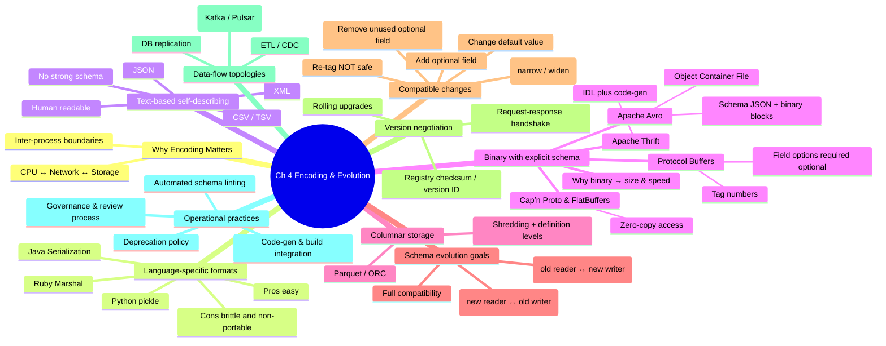

```mermaid
mindmap
  root((Ch 4  Encoding & Evolution))
    Why Encoding Matters
      Inter-process boundaries
      CPU ↔ Network ↔ Storage
    Language-specific formats
      Java Serialization
      Python pickle
      Ruby Marshal
      Pros easy
      Cons brittle and non-portable
    Text-based self-describing
      JSON
      XML
      CSV / TSV
      Human readable
      No strong schema
    Binary with explicit schema
      Apache Avro
        Schema JSON + binary blocks
        Object Container File
      Protocol Buffers
        Tag numbers
        Field options required optional
      Apache Thrift
        IDL plus code-gen
      Capʼn Proto & FlatBuffers
        Zero-copy access
      Why binary → size & speed
    Columnar storage
      Parquet / ORC
      Shredding + definition levels
    Schema evolution goals
      Backward compat (old reader ↔ new writer)
      Forward compat (new reader ↔ old writer)
      Full compatibility
    Compatible changes
      Add optional field
      Remove unused optional field
      Change default value
      Re-tag NOT safe
      Change type (narrow / widen)
    Version negotiation
      Request-response handshake
      Registry checksum / version ID
      Rolling upgrades
    Data-flow topologies
      DB replication
      Log-based pipelines (Kafka / Pulsar)
      ETL / CDC
    Operational practices
      Code-gen & build integration
      Automated schema linting
      Governance & review process
      Deprecation policy
```