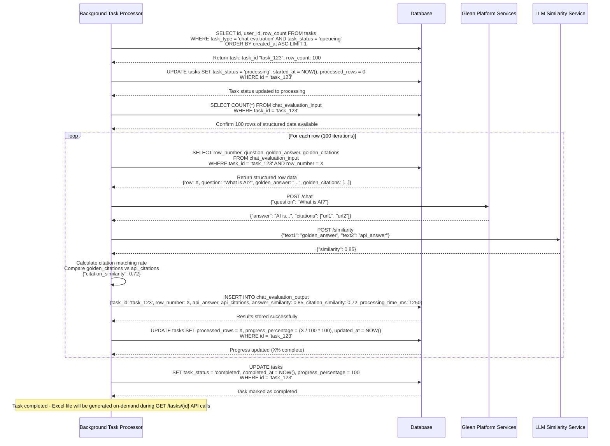
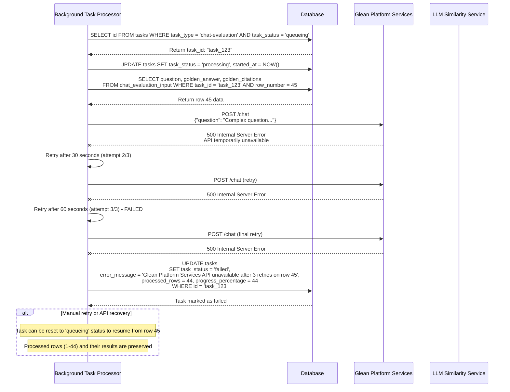
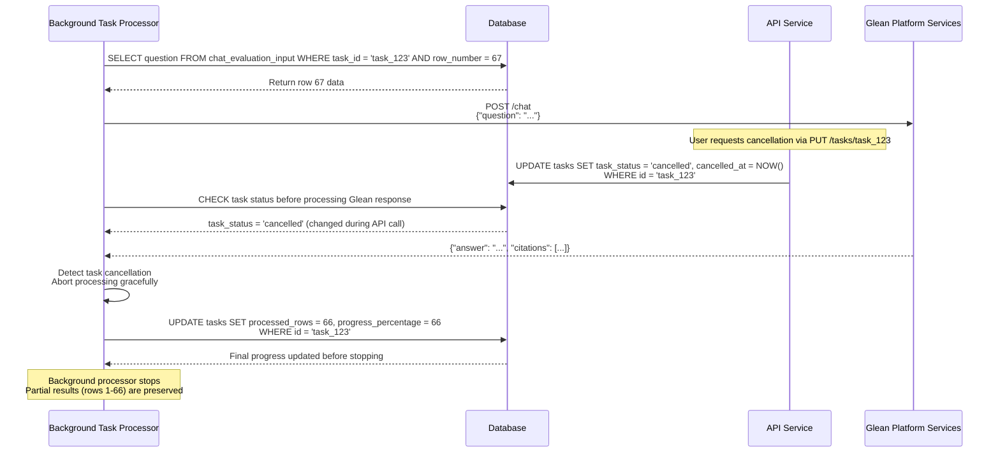

# Chat Evaluation Background Processing Sequence Diagram

## Chat Evaluation Processing Flow

### Success Flow - Process Structured Data from Input Tables

### Error Flow - API Failure During Processing

### Task Cancellation During Processing

## Processing Characteristics

### Performance Metrics
- **Processing Rate**: ~10-15 rows per minute (depending on API response times)
- **Memory Usage**: Minimal - processes one row at a time from structured data
- **Startup Time**: Immediate - no blob parsing overhead
- **Error Handling**: 3 retry attempts with exponential backoff per row
- **Progress Tracking**: Real-time updates per row with precise row counts
- **Resume Capability**: Can resume from exact failure point

### Key Features
1. **No Blob Parsing**: Data is already structured and ready for processing
2. **Immediate Processing**: No parsing delays during background processing
3. **Precise Progress**: Exact row-level progress tracking (processed_rows/row_count)
4. **Partial Results**: Completed rows are preserved even if processing fails
5. **Resume Support**: Failed tasks can resume from the exact failure point
6. **Better Error Context**: Specific row number and error details in failure messages

### Data Flow Summary
1. **Task Selection**: FIFO queue processing of chat-evaluation tasks in 'queueing' status
2. **Data Retrieval**: Direct SELECT from chat_evaluation_input table (no parsing)
3. **Row Processing**: Sequential processing with API calls per structured row
4. **Results Storage**: Store API responses and similarity scores in chat_evaluation_output
5. **Progress Updates**: Update processed_rows and progress_percentage per row
6. **Completion**: Mark task as completed when all rows processed
7. **Data Access**: Frontend can query structured results immediately via API

### Error Recovery and Resilience
- **API Failures**: Retry with exponential backoff (30s, 60s, 120s)
- **Partial Processing**: Resume from last successful row (processed_rows counter)
- **Data Integrity**: Input data and completed results preserved during failures
- **Manual Recovery**: Failed tasks can be reset to 'queueing' status for retry
- **Cancellation Support**: Graceful handling of user-initiated cancellations
- **Progress Preservation**: Exact progress tracking allows precise resume points
