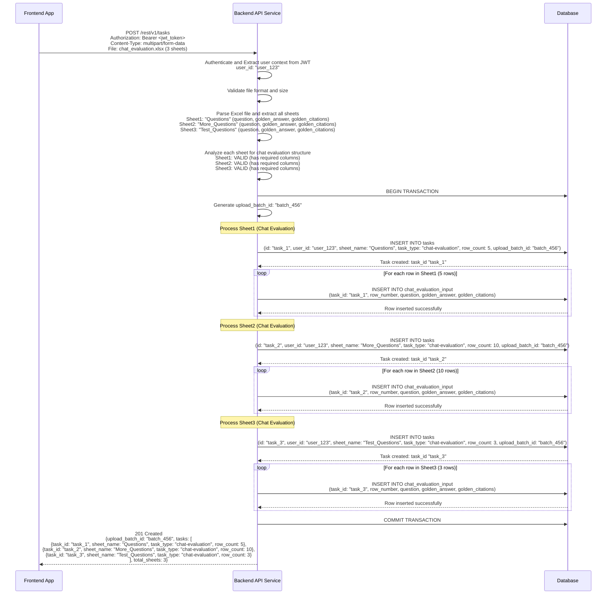
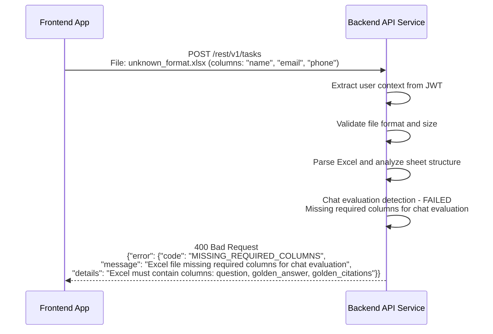
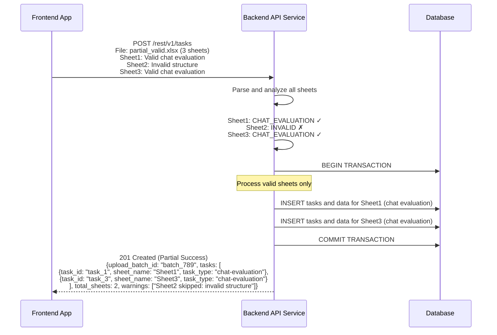
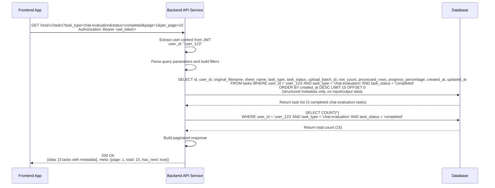
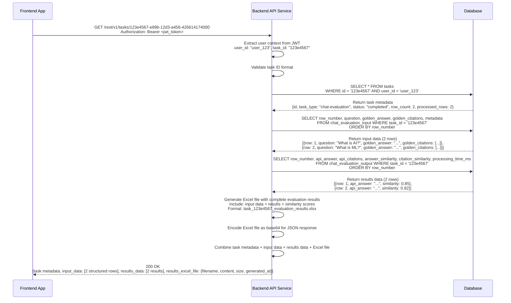
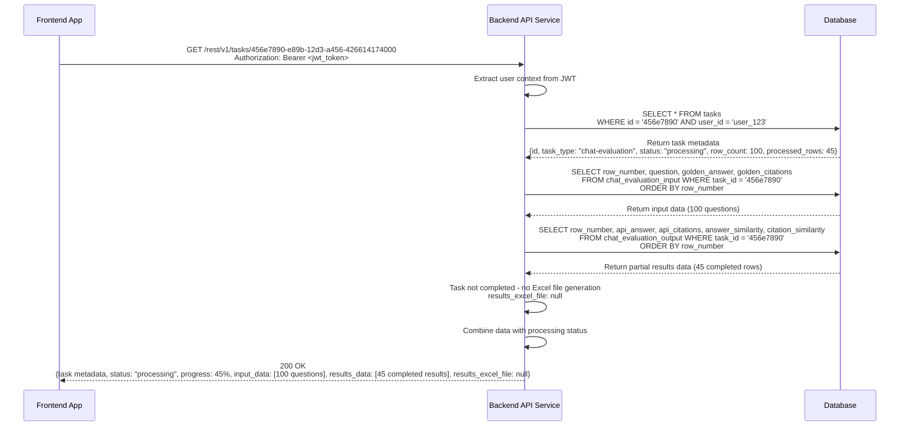
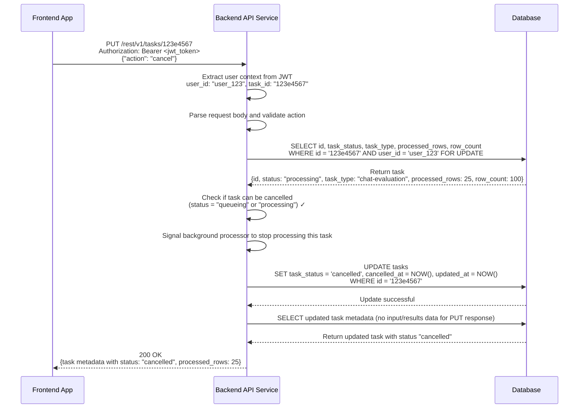
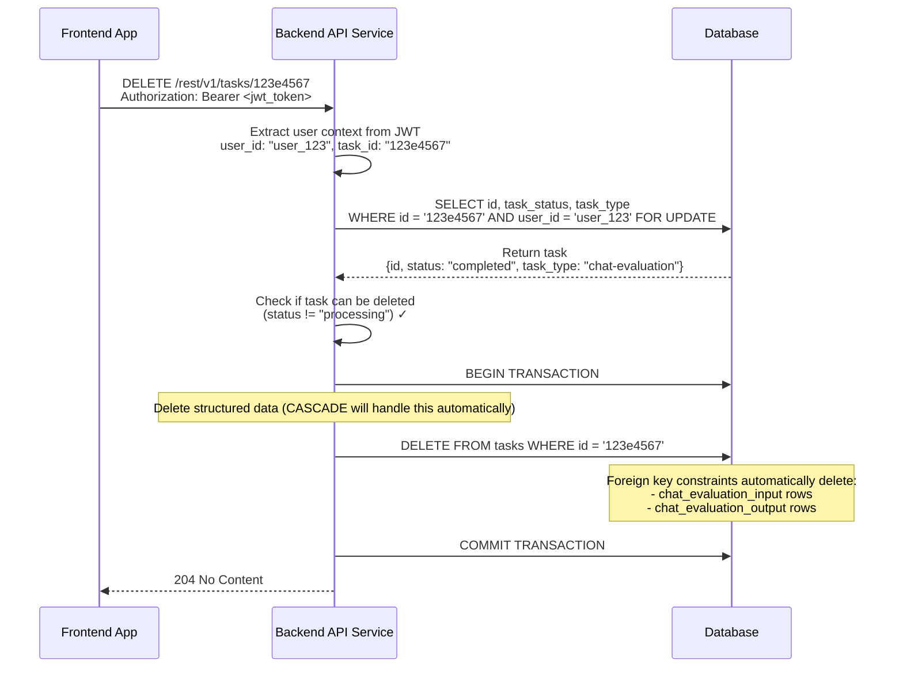
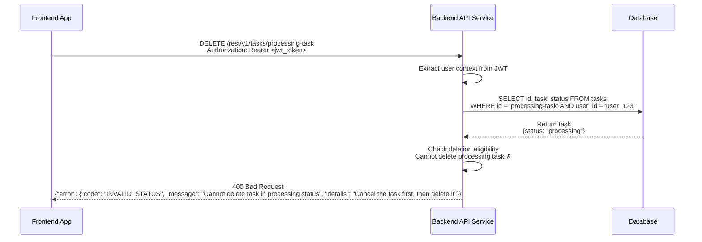

# Task Management API Request Handling Sequence Diagrams

This document contains sequence diagrams for the task management API endpoints, showing the interaction flow between frontend applications, Backend API Service, and database with direct structured data storage (no blob processing).

## Participants Legend
- **Frontend**: Internal frontend applications (Task Management UI)
- **API**: Backend API Service (handles Excel parsing and chat evaluation task detection)
- **DB**: Primary Database (structured data storage in dedicated tables)

## Architecture
Excel files are parsed during upload and stored as structured row data for chat evaluation tasks. No blob storage is used.

## Endpoints 

| Method | Endpoint | Description | Auth Level |
|--------|----------|-------------|------------|
| POST   | `/rest/v1/tasks` | Upload Excel file, parse and create structured chat evaluation tasks | User |
| GET    | `/rest/v1/tasks` | List user's tasks (metadata only) | User |
| GET    | `/rest/v1/tasks/{id}` | Get task details with structured input/results data | User |
| PUT    | `/rest/v1/tasks/{id}` | Update/cancel a task | Owner |
| DELETE | `/rest/v1/tasks/{id}` | Delete task and associated structured data | Owner |

## 1. POST /rest/v1/tasks - Excel Upload with Immediate Parsing

### Success Flow - Multi-Sheet Excel with Chat Evaluation Data

### Error Flow - Missing Required Columns

### Error Flow - Mixed Valid/Invalid Sheets

## 2. GET /rest/v1/tasks - List User Tasks (Metadata Only)

### Success Flow with Task Filtering

## 3. GET /rest/v1/tasks/{id} - Get Task with Structured Input and Results Data

### Success Flow - Chat Evaluation Task with Complete Data

### Success Flow - Chat Evaluation Task (Processing In Progress)

## 4. PUT /rest/v1/tasks/{id} - Update/Cancel Task

### Success Flow - Cancel Processing Task

## 5. DELETE /rest/v1/tasks/{id} - Delete Task and Structured Data

### Success Flow - Delete Completed Task

### Error Flow - Cannot Delete Processing Task

## Request/Response Flow Summary

### Key Features Demonstrated
- **Immediate Parsing**: Excel files parsed during upload, not in background
- **Chat Evaluation Detection**: Analysis based on required column structure
- **Structured Storage**: No blob storage - all data stored in queryable tables
- **Rich Responses**: API returns structured data instead of encoded blobs
- **Excel File Generation**: Complete evaluation results provided as downloadable Excel file
- **Background Processing Simplification**: Background jobs only process existing structured data
- **Better Error Handling**: Parsing errors caught during upload, not background processing

### Data Flow Patterns
1. **Upload → Parse → Structure → Store**: Immediate transformation to structured data
2. **Query → Join → Response**: Efficient queries with structured data joins  
3. **Background → Process → Update**: Background processing reads structured data directly
4. **Delete → Cascade**: Structured data automatically cleaned up via foreign key constraints

### Performance Characteristics
- **Upload Performance**: Slower initial upload (parsing), but better user feedback
- **Query Performance**: Much faster - no blob parsing, direct structured queries
- **Background Performance**: Faster processing - no parsing overhead
- **Storage Efficiency**: Better compression and indexing with structured data
- **Frontend Integration**: Direct data consumption without client-side parsing